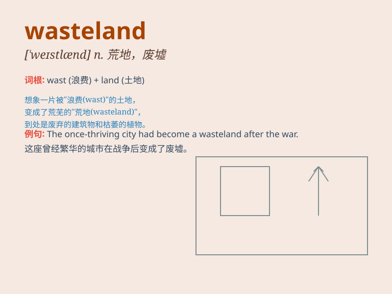

## wasteland

**英音:** _[\'weɪs(t)lænd; -lənd]_ **美音:**
_[\'westlənd]_

**译义:** *n.荒地,未开垦地,废墟,(生活方式等的)贫乏*

### 短语

+ **urban wasteland:** _城市荒地_

+ **industrial wasteland:** _工业荒地_

+ **desolate wasteland:** _荒凉的荒地_

+ **vast wasteland:** _广阔的荒地_

+ **barren wasteland:** _贫瘠的荒地_

### 例句

#### 例句1

> **The area has become a barren wasteland due to years of
deforestation.**

**中文翻译:** 由于多年的滥砍滥伐，这个地区已经变成了一片荒芜的荒地。

**单词释义:** 荒地；荒漠

#### 例句2

> **They ventured into the wasteland in search of precious
minerals.**

**中文翻译:** 他们冒险进入这片荒地寻找珍贵的矿物质。

**单词释义:** 荒地；不毛之地

#### 例句3

> **After the war, the once prosperous city turned into a
wasteland.**

**中文翻译:** 战后，这座曾经繁荣的城市变成了一片废墟。

**单词释义:** 废墟；荒芜之地

### 背诵小故事

> A brave adventurer was lost in a vast wasteland. There was nothing
but dry sand and dead trees. He struggled to find water and food,
realizing the harshness of this desolate place.

**一位勇敢的冒险家迷失在一片广袤的荒原中。那里除了干燥的沙子和枯树什么都没有。他努力寻找水和食物，意识到了这个荒凉之地的严酷。**

### 图义

