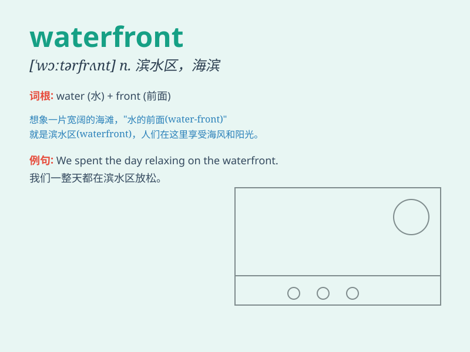

## waterfront

**英音:** _[\'wɔːtəfrʌnt]_ **美音:** _[\'wɔtɚfrʌnt]_

**译义:** *n.水边地码头区,滨水地区*

### 短语

+ **urban waterfront:** _城市滨水区_

+ **waterfront development:** _滨水区开发_

+ **waterfront property:** _滨水物业_

+ **waterfront park:** _滨水公园_

+ **scenic waterfront:** _风景优美的滨水区_

### 例句

#### 例句1

> **The city\'s waterfront is a popular destination for tourists.**

**中文翻译:** 这座城市的滨水区是游客们喜爱的目的地。

**单词释义:** 滨水区

#### 例句2

> **They decided to build a new restaurant on the waterfront.**

**中文翻译:** 他们决定在滨水区建一家新餐馆。

**单词释义:** 滨水区

#### 例句3

> **The waterfront was crowded with people enjoying the view.**

**中文翻译:** 滨水区挤满了欣赏风景的人。

**单词释义:** 滨水区

### 背诵小故事

> A young artist was always drawn to the waterfront. He loved painting
the beautiful views of the water and the ships. One day, he had a great
inspiration and created a masterpiece there. The waterfront became his
lucky place.

**一位年轻的艺术家总是被海滨吸引。他喜欢画水和船只的美丽景色。有一天，他在那里获得了巨大的灵感，并创作了一幅杰作。海滨成了他的幸运之地。**

### 图义

