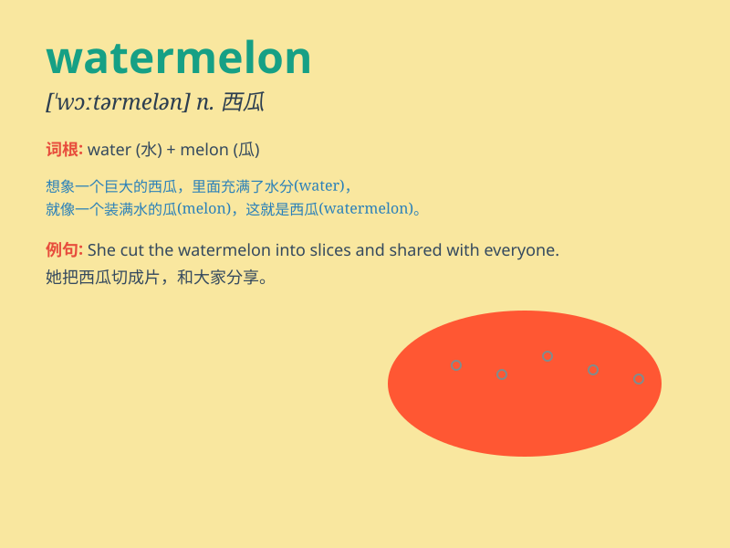

## watermelon

**英音:** _[\'wɔːtəmelən]_ **美音:** _[\'wɔtɚmɛlən]_

**译义:** *n.西瓜*

### 短语

+ **watermelon juice:** _西瓜汁_

+ **watermelon slice:** _西瓜片_

+ **seedless watermelon:** _无籽西瓜_

+ **sweet watermelon:** _甜西瓜_

+ **watermelon rind:** _西瓜皮_

### 例句

#### 例句1

> **I bought a big watermelon at the market.**

**中文翻译:** 我在市场买了一个大西瓜。

**单词释义:** 西瓜

#### 例句2

> **The children were eating slices of watermelon.**

**中文翻译:** 孩子们正在吃一片片的西瓜。

**单词释义:** 西瓜

#### 例句3

> **She cut the watermelon into small pieces.**

**中文翻译:** 她把西瓜切成了小块。

**单词释义:** 西瓜

### 背诵小故事

> One hot summer day, a little boy was very thirsty. His mom cut a big
WATERMELON for him. The juicy red flesh and black seeds made him happy.
He ate a lot and felt cool and refreshed.

**在一个炎热的夏日，一个小男孩非常口渴。他的妈妈为他切了一个大西瓜。多汁的红色瓜瓤和黑色的籽让他很开心。他吃了很多，感到凉爽又精神。**

### 图义

