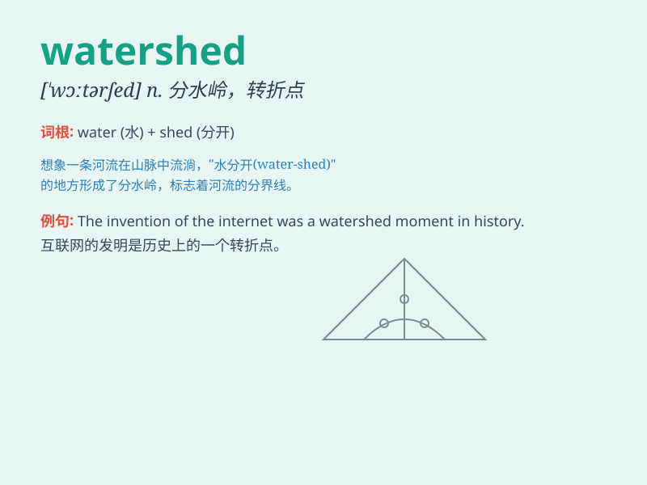

## watershed

**英音:** _[\'wɔːtəʃed]_ **美音:** _[\'wɔtɚʃɛd]_

**译义:** *n.分水岭*

### 短语

+ **watershed moment:** _关键时刻；转折点_

+ **watershed area:** _分水岭地区；流域_

+ **major watershed:** _主要分水岭_

+ **watershed divide:** _分水岭；分水界_

+ **watershed management:** _流域管理_

### 例句

#### 例句1

> **The new law was a watershed in environmental protection.**

**中文翻译:** 这项新法律是环境保护方面的一个转折点。

**单词释义:** 转折点；分水岭

#### 例句2

> **This year marks a watershed in our company\'s history.**

**中文翻译:** 今年标志着我们公司历史上的一个分水岭。

**单词释义:** 分水岭；重大转折点

#### 例句3

> **The invention of the internet was a watershed moment for
communication.**

**中文翻译:** 互联网的发明是通信领域的一个关键时刻。

**单词释义:** 关键时刻；分水岭

### 背诵小故事

> A young hiker was lost in the mountains. When he finally reached a
high point and saw the river divide into two branches, he knew it was a
watershed moment. It marked the point where his journey changed and he
found the right way home.

**一位年轻的徒步旅行者在山中迷路了。当他最终到达一个高点，看到河流分成两条支流时，他知道这是一个分水岭时刻。它标志着他的旅程发生了改变，他找到了回家的正确道路。**

### 图义

