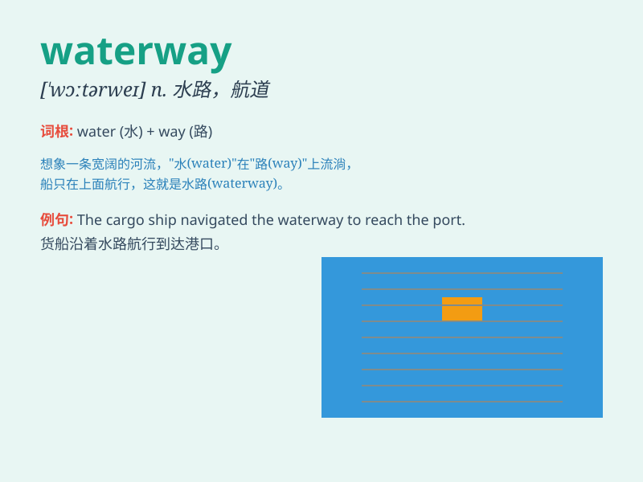

## waterway

**英音:** _[\'wɔːtəweɪ]_ **美音:** _[\'wɔtɚwe]_

**译义:** *n.水路,排水沟*

### 短语

+ **navigable waterway:** _可通航的水道_

+ **inland waterway:** _内陆水道_

+ **major waterway:** _主要水道_

+ **natural waterway:** _天然水道_

+ **artificial waterway:** _人工水道_

### 例句

#### 例句1

> **The waterway is too narrow for large ships to pass through.**

**中文翻译:** 这条水道太窄了，大型船只无法通过。

**单词释义:** 水道

#### 例句2

> **They are planning to improve the waterway to increase
transportation efficiency.**

**中文翻译:** 他们正在计划改善这条水道以提高运输效率。

**单词释义:** 水道

#### 例句3

> **The waterway was blocked by fallen trees after the storm.**

**中文翻译:** 暴风雨过后，水道被倒下的树木堵塞了。

**单词释义:** 水道

### 背诵小故事

> A little boat was lost in a waterway. It struggled to find the right
direction. But finally, with the help of the stars, it reached the safe
harbor. The waterway was full of adventures and mysteries.

**一艘小船在航道中迷路了。它努力寻找正确的方向。但最终，在星星的帮助下，它到达了安全的港湾。这条航道充满了冒险和神秘。**

### 图义

