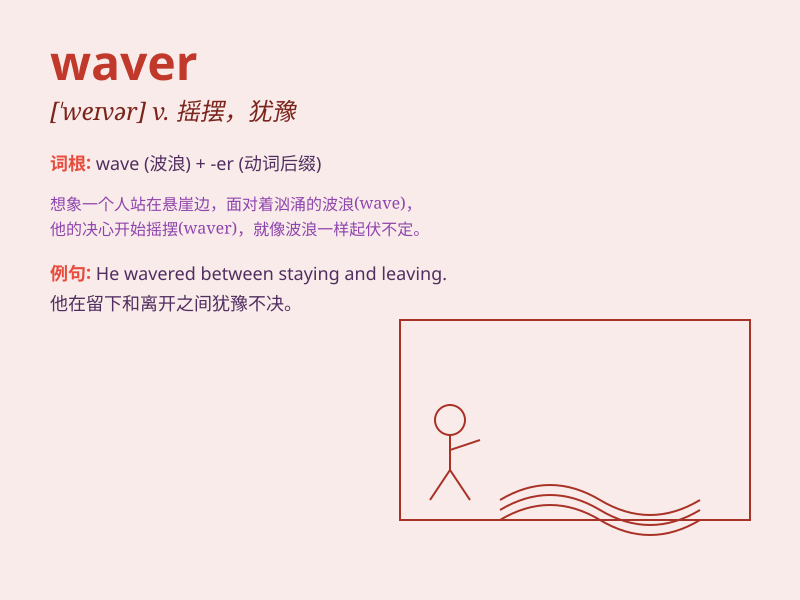

## waver

**英音:** _[\'weɪvə]_ **美音:** _[\'wevɚ]_

**译义:** *n.动摇,开始退让,踌躇,挥动者vi.摇摆,颤抖,摆动,摇曳,犹豫*

### 短语

+ **waver in decision:** _在决策上犹豫不决_

+ **waver between:** _在\...\...之间摇摆不定_

+ **waver on an issue:** _在某个问题上动摇_

+ **begin to waver:** _开始动摇_

+ **waver unsteadily:** _不稳定地摇晃_

### 例句

#### 例句1

> **She wavered between going to the party and staying home to
study.**

**中文翻译:** 她在去参加聚会和留在家里学习之间犹豫不决。

**单词释义:** 犹豫不决

#### 例句2

> **His voice wavered as he told the sad story.**

**中文翻译:** 他讲述那个悲伤的故事时，声音颤抖了。

**单词释义:** 颤抖

#### 例句3

> **The flame of the candle wavered in the draft.**

**中文翻译:** 蜡烛的火焰在气流中摇曳。

**单词释义:** 摇曳

### 背诵小故事

> 有个勇敢的战士在战场上，面对敌人的攻击，他的决心开始 waver
了。他一会儿想冲锋，一会儿又想退缩，就像风中晃动的蜡烛火焰。这就是
waver，犹豫不决、动摇的意思。

**有个战士在战场，面对敌人攻击，决心开始动摇，一会儿想冲一会儿想退，像风中晃动的烛火。这体现了
waver 犹豫不决、动摇的意思。**

### 图义

