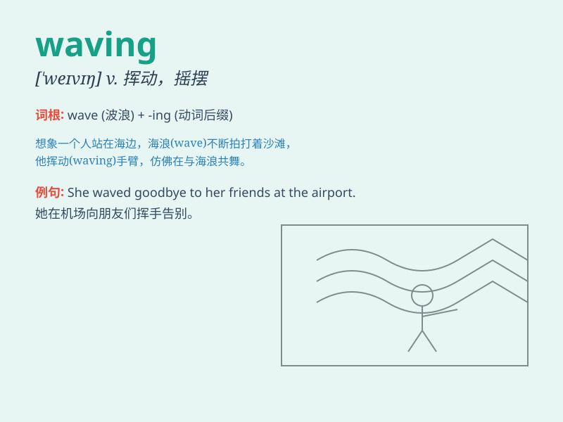

## waving

**英音:** _[ˈweɪvɪŋ]_ **美音:** _[ˈweɪvɪŋ]_

**译义:** *v.挥动，摇摆（wave的现在分词形式）；n.挥动，摇摆*

### 短语

+ **waving flag:** _飘扬的旗帜_

+ **waving goodbye:** _挥手道别_

+ **waving hand:** _挥动的手_

+ **waving hair:** _飘动的头发_

+ **waving palm:** _摇曳的棕榈树_

### 例句

#### 例句1

> **She was waving goodbye to her friends.**

**中文翻译:** 她正在向她的朋友们挥手道别。

**单词释义:** 挥手（表示告别）

#### 例句2

> **The flag was waving in the wind.**

**中文翻译:** 旗帜在风中飘扬。

**单词释义:** 飘扬，飘动

#### 例句3

> **He saw a man waving at him from across the street.**

**中文翻译:** 他看到一个男人在街对面朝他挥手。

**单词释义:** 挥手（引起注意）

### 背诵小故事

> One sunny day, I was walking on the beach and saw a little girl
waving excitedly at me. She was trying to get my attention to show me
the beautiful shell she found. The movement of her hand was like a
gentle wind, which made me remember the word \'waving\'.

**在一个阳光明媚的日子，我走在海滩上，看到一个小女孩兴奋地向我挥手。她试图引起我的注意，给我看她找到的漂亮贝壳。她手部的动作就像一阵微风，这让我记住了'waving'这个单词。**

### 图义

