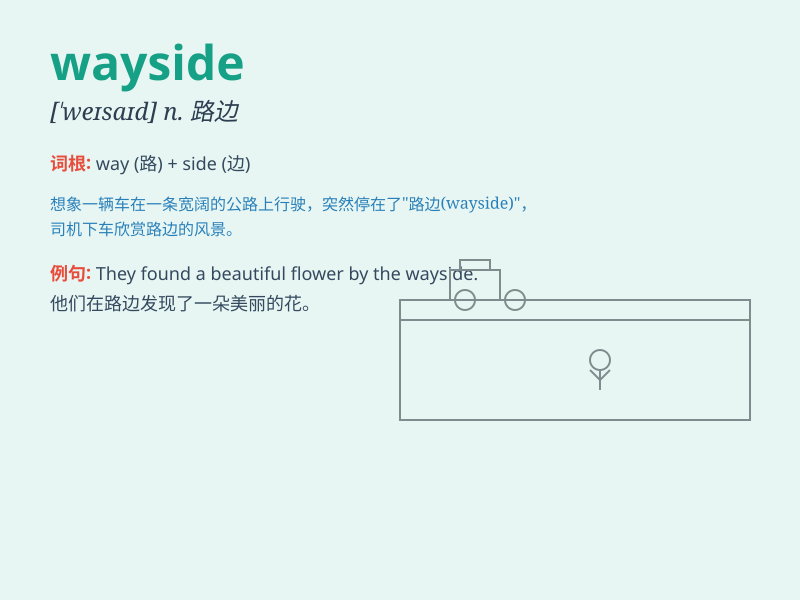

## wayside

**英音:** _[\'weɪsaɪd]_ **美音:** _[\'we\'saɪd]_

**译义:** *n.路旁adj.路旁的*

### 短语

+ **fall by the wayside:** _半途而废；中途失败_

+ **lie by the wayside:** _被搁置；被忽视_

+ **drop by the wayside:** _半途退出；中途放弃_

+ **pass by the wayside:** _被忽略；被遗忘_

+ **be cast aside by the wayside:** _被抛弃在路边；被抛弃_

### 例句

#### 例句1

> **The flowers by the wayside are very beautiful.**

**中文翻译:** 路边的花非常漂亮。

**单词释义:** 路边

#### 例句2

> **He stopped to rest by the wayside.**

**中文翻译:** 他在路边停下来休息。

**单词释义:** 路边

#### 例句3

> **The old man sat down on the wayside bench.**

**中文翻译:** 那位老人在路边的长椅上坐下。

**单词释义:** 路边

### 背诵小故事

> A traveler was walking along a long road. Tired and thirsty, he sat
down by the wayside. Suddenly, he found a hidden treasure there. The
wayside became a lucky place for him.

**一位旅行者正沿着一条长路行走。又累又渴，他在路边坐了下来。突然，他在路边发现了一处隐藏的宝藏。路边对他来说变成了一个幸运之地。**

### 图义

