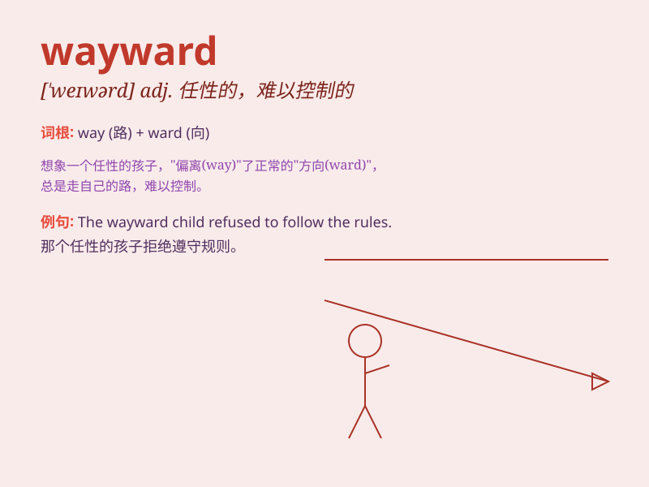

## wayward

**英音:** _[\'weɪwəd]_ **美音:** _[\'wewɚd]_

**译义:** *adj.任性的*

### 短语

+ **wayward child:** _任性的孩子_

+ **wayward behavior:** _任性的行为_

+ **wayward wind:** _飘忽不定的风_

+ **wayward thoughts:** _反复无常的想法_

+ **wayward tendencies:** _任性的倾向_

### 例句

#### 例句1

> **The wayward child often disobeyed his parents.**

**中文翻译:** 这个任性的孩子经常不听父母的话。

**单词释义:** 任性的

#### 例句2

> **The wayward wind changed direction frequently.**

**中文翻译:** 这阵变幻无常的风频繁改变方向。

**单词释义:** 变幻无常的

#### 例句3

> **His wayward behavior caused a lot of trouble at school.**

**中文翻译:** 他那难以捉摸的行为在学校引起了很多麻烦。

**单词释义:** 难以捉摸的

### 背诵小故事

> A wayward child always strayed from the path home. One day, lost in a
forest, he finally realized the importance of following the right way.
\'Wayward\' means difficult to control or predict, just like this
child\'s behavior.

**一个任性的孩子总是偏离回家的路。有一天，他在森林里迷路了，终于意识到走正确道路的重要性。\'wayward\'意思是难以控制或难以预测的，就像这个孩子的行为。**

### 图义

