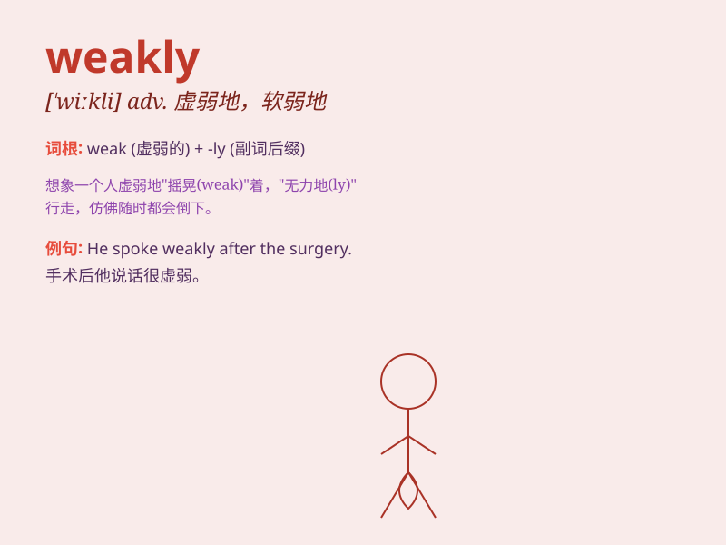

## weakly

**英音:** _[\'wiːklɪ]_ **美音:** _[\'wikli]_

**译义:** *adv.虚弱地,软弱地,有病地adj.虚弱的,软弱的,有病的*

### 短语

+ **weakly interacting:** _弱相互作用的_

+ **weakly acidic:** _弱酸性的_

+ **weakly positive:** _弱阳性的_

+ **weakly bound:** _结合力弱的_

+ **weakly magnetized:** _弱磁化的_

### 例句

#### 例句1

> **He smiled weakly at me.**

**中文翻译:** 他朝我淡淡地笑了笑。

**单词释义:** 微弱地；无力地

#### 例句2

> **The old man walked weakly along the street.**

**中文翻译:** 这位老人虚弱地沿着街道走。

**单词释义:** 虚弱地

#### 例句3

> **The plant is growing weakly due to lack of sunlight.**

**中文翻译:** 由于缺乏阳光，这株植物生长得很弱。

**单词释义:** 软弱地；无力地

### 背诵小故事

> Once upon a time, there was a little rabbit named Weakly. It was
always very tired and had no strength to run fast. Because it was weak,
it needed to eat more carrots to become strong. So, \'weakly\' means in
a weak manner.

**从前，有一只叫 Weakly
的小兔子。它总是很累，没有力气跑得很快。因为它很虚弱，所以需要吃更多胡萝卜来变得强壮。所以，weakly
意思是以虚弱的方式。**

### 图义

