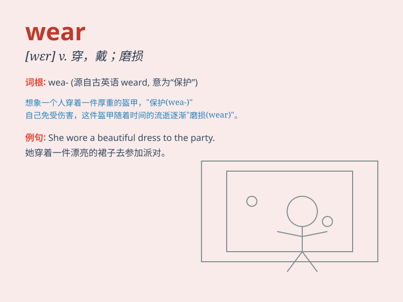

## wear

**英音:** _[weə]_ **美音:** _[wɛr]_

**译义:** *vt.穿,戴v.(～ out) 磨损,用旧,(～ out) 穿着*

### 短语

+ **wear out:** _穿破；用坏；使疲乏；耗尽_

+ **wear off:** _逐渐消失；消逝；磨损_

+ **wear away:** _磨损；消逝；消磨_

+ **wear down:** _磨损；使疲劳；使厌烦_

+ **wear thin:** _逐渐变弱；变得不受欢迎；变得兴趣索然_

### 例句

#### 例句1

> **She always wears a red dress to parties.**

**中文翻译:** 她参加聚会总是穿一条红色的连衣裙。

**单词释义:** 穿着，穿戴

#### 例句2

> **The stone steps have worn smooth over time.**

**中文翻译:** 随着时间的推移，这些石头台阶已经被磨平了。

**单词释义:** 磨损，磨坏

#### 例句3

> **He wore a worried expression on his face.**

**中文翻译:** 他脸上带着忧虑的神情。

**单词释义:** 流露，面带

### 背诵小故事

> One day, Mary decided to go for a long walk. She wore a beautiful
dress and comfortable shoes. But after a while, the shoes started to
hurt her feet. She realized that not all that is worn is perfect.

**一天，玛丽决定去长距离散步。她穿着一条漂亮的裙子和舒适的鞋子。但过了一会儿，鞋子开始磨她的脚。她意识到不是所有穿在身上的东西都是完美的。**

### 图义

