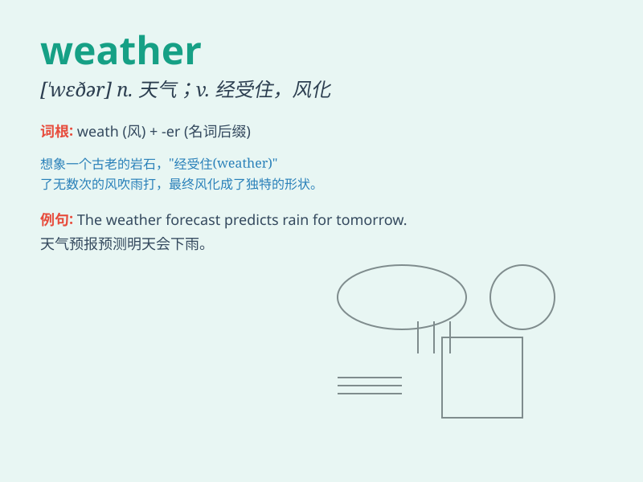

## weather

**英音:** _[\'weðə]_ **美音:** _[\'wɛðɚ]_

**译义:**
*n.天气,气候,气象,处境adj.迎风的,露天的vt.使受风吹雨打,侵蚀,使风化,经受住vi.风化,受侵蚀,经受风雨*

### 短语

+ **weather forecast:** _天气预报_

+ **weather conditions:** _天气状况_

+ **bad weather:** _恶劣天气_

+ **weather the storm:** _经受住暴风雨；渡过难关_

+ **fair weather:** _晴天；好天气_

### 例句

#### 例句1

> **The weather is nice today.**

**中文翻译:** 今天天气很好。

**单词释义:** 天气

#### 例句2

> **We need to prepare for bad weather.**

**中文翻译:** 我们需要为恶劣天气做准备。

**单词释义:** 天气

#### 例句3

> **The ship was lost in rough weather.**

**中文翻译:** 那艘船在恶劣的天气中失踪了。

**单词释义:** 天气

### 背诵小故事

> One day, a little bird was flying in the sky. It noticed the weather
changing. Clouds gathered, and the wind blew stronger. It knew it was
going to rain. So, it quickly flew back home. \'Weather\' is what tells
us if it\'s sunny, rainy, or windy.

**有一天，一只小鸟在天空中飞翔。它注意到天气在变化。乌云聚集，风刮得更猛了。它知道要下雨了。于是，它迅速飞回家。\'weather\'就是告诉我们是晴天、雨天还是刮风天的那个东西。**

### 图义

