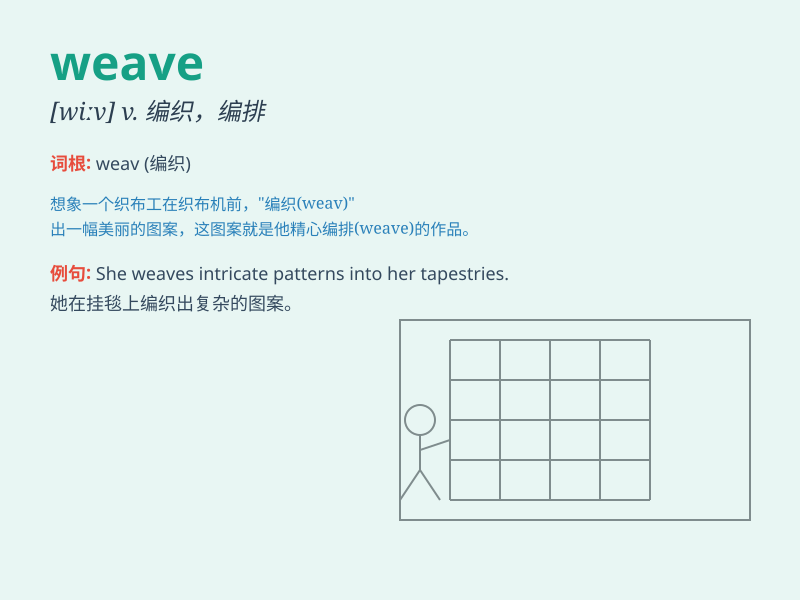

## weave

**英音:** _[wiːv]_ **美音:** _[wiv]_

**译义:**
*n.编法,织法,编织vt.编织,组合,编排,使迂回前进vi.纺织,迂回行进,摇晃n.织法,织物*

### 短语

+ **weave through:** _迂回穿行_

+ **weave a story:** _编一个故事_

+ **weave fabric:** _织布料_

+ **weave a basket:** _编一个篮子_

+ **weave in and out:** _穿梭进出_

### 例句

#### 例句1

> **She weaves baskets from bamboo.**

**中文翻译:** 她用竹子编篮子。

**单词释义:** 编织

#### 例句2

> **The driver had to weave in and out of the traffic.**

**中文翻译:** 司机不得不在车流中穿来穿去。

**单词释义:** 迂回行进

#### 例句3

> **The story weaves together various elements of mystery and
adventure.**

**中文翻译:** 这个故事把神秘和冒险的各种元素交织在一起。

**单词释义:** 使交织

### 背诵小故事

> A spider was weaving a beautiful web. It moved its legs skillfully to
weave the silk together. The web became stronger and stronger. Remember,
\'weave\' means to make something by crossing threads or fibers.

**一只蜘蛛正在织一张漂亮的网。它熟练地移动它的腿把丝织在一起。网变得越来越牢固。记住，\'weave\'意思是通过交叉线或纤维来制作某物。**

### 图义

