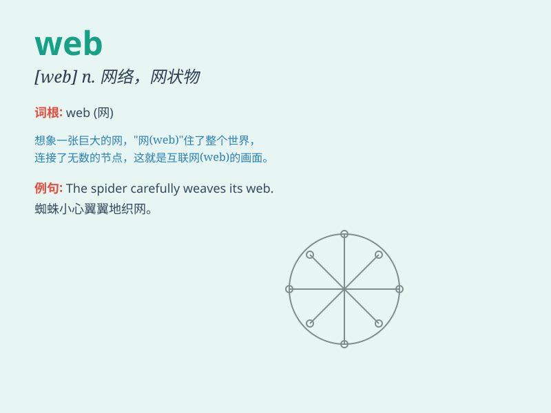

## web

**英音:** _[web]_ **美音:** _[wɛb]_

**译义:**
*n.环球网,网,蛛丝,蹼,翼手,织物,圈套,卷筒纸;vi.使陷入罗网,形成网;vt.织蜘蛛网于,使落入圈套*

### 短语

+ **world wide web:** _万维网_

+ **web browser:** _网络浏览器_

+ **web page:** _网页_

+ **web site:** _网站_

+ **web design:** _网页设计_

### 例句

#### 例句1

> **The spider spins a web in the corner of the room.**

**中文翻译:** 蜘蛛在房间的角落里织网。

**单词释义:** 网

#### 例句2

> **The World Wide Web has changed the way we communicate.**

**中文翻译:** 万维网改变了我们交流的方式。

**单词释义:** 网络

#### 例句3

> **The bird got caught in the web of the net.**

**中文翻译:** 这只鸟被网子网住了。

**单词释义:** 网

### 背诵小故事

>
想象一只小蜘蛛在努力织网（web），它从这头跑到那头，吐出细丝，精心编织。终于，一张漂亮的网完成了，它就等着小飞虫自投罗网。这张网就像互联网一样，把各种信息连接起来。

**想象一只小蜘蛛织网的情景来辅助记忆单词'web（网）'，将网比作互联网，把信息相连。**

### 图义

