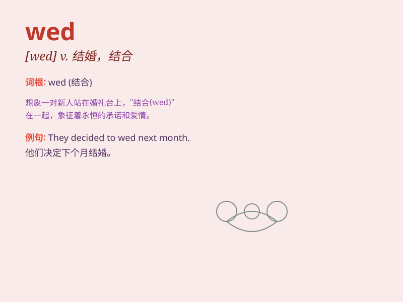

## wed

**英音:** _[wed]_ **美音:** _[wɛd]_

**译义:** *v.娶,嫁,结婚n. 星期三(=Wednesday)*

### 短语

+ **wed someone:** _与某人结婚_

+ **wed in haste:** _仓促结婚_

+ **wed happily:** _幸福地结婚_

+ **wed secretly:** _秘密结婚_

+ **wed traditionally:** _按照传统结婚_

### 例句

#### 例句1

> **They decided to wed next month.**

**中文翻译:** 他们决定下个月结婚。

**单词释义:** 结婚

#### 例句2

> **She has been wed for five years.**

**中文翻译:** 她结婚已经五年了。

**单词释义:** 结婚（处于已婚状态）

#### 例句3

> **The prince wedded the beautiful princess.**

**中文翻译:** 王子娶了美丽的公主。

**单词释义:** 娶；嫁

### 背诵小故事

> A prince and a princess had a beautiful wedding. They decided to wed
and promised to love each other forever. The day they wed was full of
joy and happiness.

**一位王子和一位公主举行了一场美丽的婚礼。他们决定结婚，并承诺永远相爱。他们结婚的那天充满了欢乐和幸福。**

### 图义

