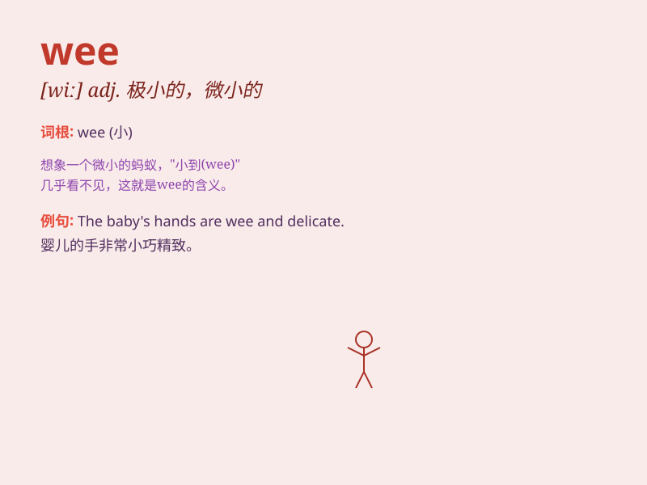

## wee

**英音:** _[wiː]_ **美音:** _[wi]_

**译义:** *adj.很少的,微小的,很早的n.一点点,一会儿,极小的空间*

### 短语

+ **wee hours:** _凌晨；深夜_

+ **wee bit:** _一点点；少量_

+ **wee small:** _很小的；微小的_

+ **wee lad:** _小男孩_

+ **wee lass:** _小女孩_

### 例句

#### 例句1

> **The baby is still wee and needs a lot of care.**

**中文翻译:** 这个婴儿还很小，需要很多照顾。

**单词释义:** 小的；幼小的

#### 例句2

> **She had a wee nap in the afternoon.**

**中文翻译:** 她下午小睡了一会儿。

**单词释义:** 短暂的；小的

#### 例句3

> **He took a wee break from work.**

**中文翻译:** 他工作中小小地休息了一下。

**单词释义:** 短时间的；少量的

### 背诵小故事

> A little mouse was always wee. One day, it found a big cheese but
couldn\'t move it because it was too wee. So it called its friends to
help. Finally, they enjoyed the cheese together.

**一只小老鼠总是小小的。有一天，它发现了一块大奶酪，但因为它太小了搬不动。所以它叫它的朋友们来帮忙。最后，它们一起享用了奶酪。**

### 图义

