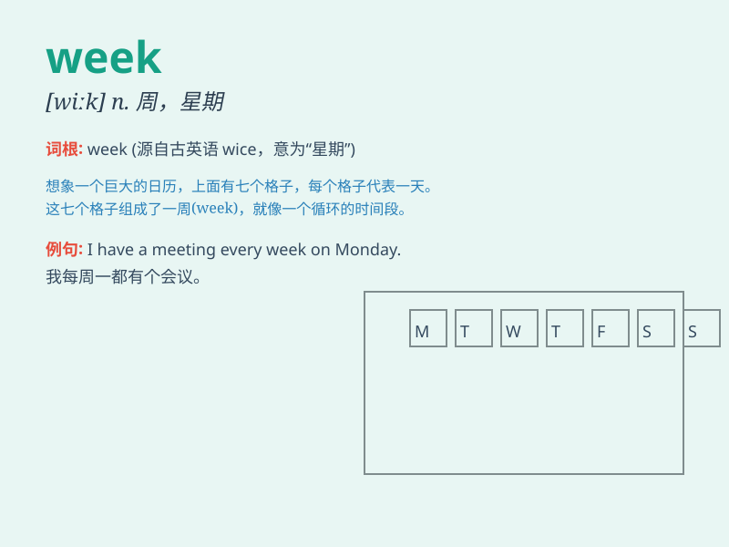

## week

**英音:** _[wiːk]_ **美音:** _[wik]_

**译义:** *n.星期,周*

### 短语

+ **last week:** _上周_

+ **this week:** _本周；这周_

+ **next week:** _下周_

+ **week after week:** _一周又一周；接连好几周_

+ **every week:** _每周；每星期_

### 例句

#### 例句1

> **I have a lot of work to do this week.**

**中文翻译:** 这周我有很多工作要做。

**单词释义:** 周；星期

#### 例句2

> **The meeting is scheduled for next week.**

**中文翻译:** 会议安排在下周。

**单词释义:** 周；星期

#### 例句3

> **She goes to the gym twice a week.**

**中文翻译:** 她每周去健身房两次。

**单词释义:** 周；星期

### 背诵小故事

>
想象一下，一只小蜗牛在努力爬行，它从周一出发，经过周二、周三、周四、周五，爬得有点累了在周六休息，最后在周日到达了目的地。这就是一个完整的'week'（星期，周）。

**想象一只小蜗牛的一周行程来记住 week 这个表示星期、周的单词**

### 图义

