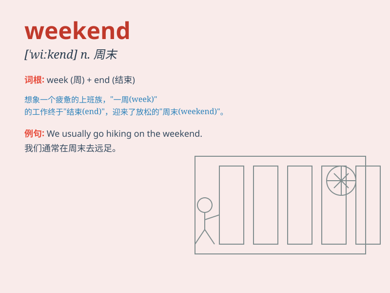

## weekend

**英音:** _[wiːkˈɛnd]_ **美音:** _[ˈwikend]_

**译义:** *n.周末,周末休假adj.周末的vi.度周末的*

### 短语

+ **on the weekend:** _在周末_

+ **at the weekend:** _在周末_

+ **weekend party:** _周末派对_

+ **weekend trip:** _周末旅行_

+ **long weekend:** _长周末_

### 例句

#### 例句1

> **I usually go shopping on the weekend.**

**中文翻译:** 我通常在周末去购物。

**单词释义:** 周末

#### 例句2

> **They had a great time at the beach over the weekend.**

**中文翻译:** 他们周末在海滩度过了一段美好的时光。

**单词释义:** 周末

#### 例句3

> **What are your plans for this weekend?**

**中文翻译:** 这个周末你有什么计划？

**单词释义:** 周末

### 背诵小故事

> On the weekend, Tom was very happy. He didn\'t have to go to school.
He could play games, watch cartoons and sleep late. It was a relaxing
time for him.

**在周末，汤姆非常开心。他不用去上学。他可以玩游戏、看动画片并且睡懒觉。对他来说这是一段放松的时光。**

### 图义

