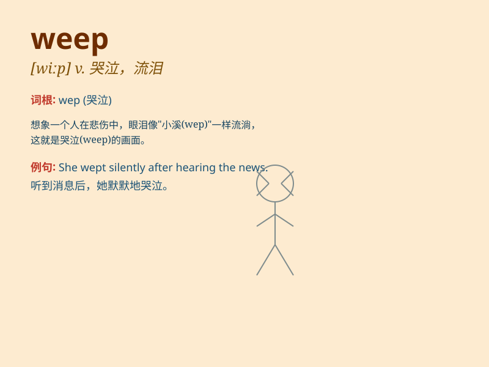

## weep

**英音:** _[wiːp]_ **美音:** _[wip]_

**译义:**
*n.哭,哭泣,滴下vi.哭泣,流泪,哀悼,滴落vt.哭着使\...,悲叹,滴下*

### 短语

+ **weep for:** _为\...而哭泣_

+ **weep over:** _因\...而哭泣_

+ **weep away:** _冲走；冲掉_

+ **weep out:** _哭着说出_

+ **weep bitterly:** _痛苦地哭泣_

### 例句

#### 例句1

> **She wept when she heard the sad news.**

**中文翻译:** 当她听到这个悲伤的消息时，她哭了。

**单词释义:** 哭泣

#### 例句2

> **The little girl wept for her lost doll.**

**中文翻译:** 小女孩为她丢失的洋娃娃哭泣。

**单词释义:** 流泪

#### 例句3

> **He wept with joy at the reunion with his long-lost friend.**

**中文翻译:** 他在与失散多年的朋友重逢时高兴得哭了。

**单词释义:** 呜咽

### 背诵小故事

> A little girl lost her favorite doll and began to weep. Tears rolled
down her cheeks as she felt so sad. Her mom comforted her, saying
everything would be okay. Remember, \'weep\' means to cry.

**一个小女孩丢失了她最喜欢的玩偶，然后开始哭泣。眼泪顺着她的脸颊滚落，因为她感到非常伤心。她的妈妈安慰她，说一切都会好起来的。记住，\'weep\'的意思是哭泣。**

### 图义

