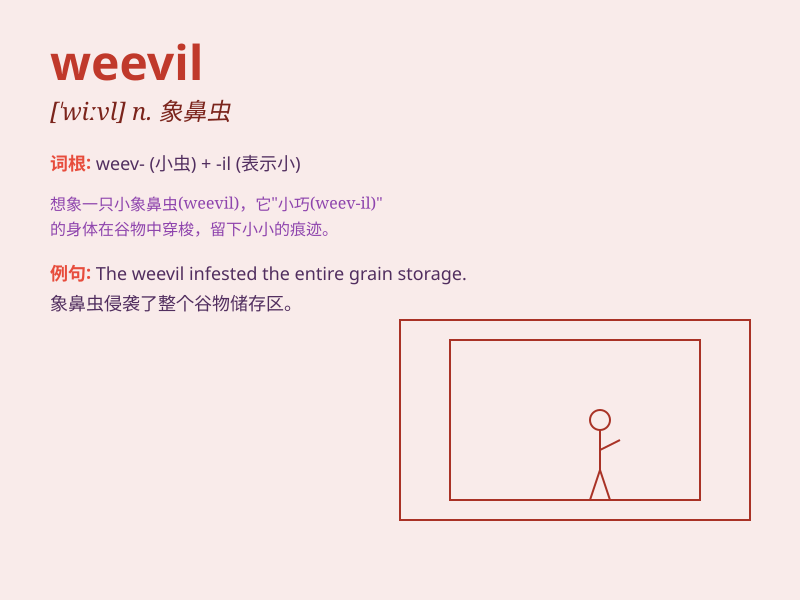

## weevil

**英音:** _[\'wiːv(ə)l; \'wiːvɪl]_ **美音:** _[\'wivl]_

**译义:** *n.[昆]象鼻虫*

### 短语

+ **boll weevil:** _棉铃象甲_

+ **grain weevil:** _谷象_

+ **pea weevil:** _豌豆象_

+ **weevil damage:** _象鼻虫损害_

+ **weevil infestation:** _象鼻虫侵扰_

### 例句

#### 例句1

> **The weevil has damaged a large part of the wheat crop.**

**中文翻译:** 象鼻虫损害了很大一部分小麦作物。

**单词释义:** 象鼻虫

#### 例句2

> **She found a weevil in the flour when she was baking.**

**中文翻译:** 她烘焙的时候在面粉里发现了一只象鼻虫。

**单词释义:** 象鼻虫

#### 例句3

> **The storekeeper was worried about the weevils in the grains.**

**中文翻译:** 店主很担心谷物里的象鼻虫。

**单词释义:** 象鼻虫

### 背诵小故事

> A little weevil was lost in a big forest. It struggled to find its
way home. Finally, with its perseverance, it found a path and reunited
with its friends. Remember, \'weevil\' is a kind of small beetle.

**一只小象鼻虫在大森林里迷路了。它努力寻找回家的路。最后，凭借它的毅力，它找到了一条路，并与朋友们团聚了。记住，\'weevil\'是一种小甲虫。**

### 图义

