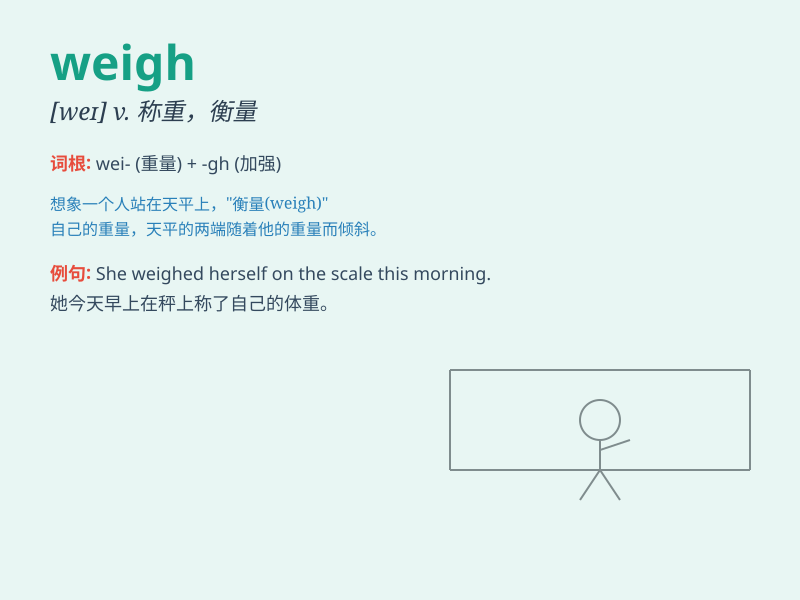

## weigh

**英音:** _[weɪ]_ **美音:** _[weɪ]_

**译义:** *vt.称\...重量,称vi.重(若干)*

### 短语

+ **weigh in:** _参加比赛前量体重；发表有分量的意见_

+ **weigh out:** _称出_

+ **weigh up:** _权衡；估量_

+ **weigh on:** _重压于；使苦恼_

+ **weigh down:** _压弯；压垮_

### 例句

#### 例句1

> **The fruit weighs about 500 grams.**

**中文翻译:** 这个水果大约重 500 克。

**单词释义:** 重

#### 例句2

> **She weighs herself every morning.**

**中文翻译:** 她每天早上称自己的体重。

**单词释义:** 称\...\...的重量

#### 例句3

> **It\'s important to weigh the pros and cons before making a
decision.**

**中文翻译:** 在做决定之前权衡利弊是很重要的。

**单词释义:** 权衡；斟酌

### 背诵小故事

> One day, a little monkey wanted to know the weight of a big fruit.
So, it found a scale and put the fruit on it. The act of determining the
fruit\'s mass was called \'weigh\'.

**一天，一只小猴子想知道一个大水果的重量。于是，它找了一个秤，把水果放上去。确定水果质量的这个行为就叫做\'weigh（称重）\'。**

### 图义

