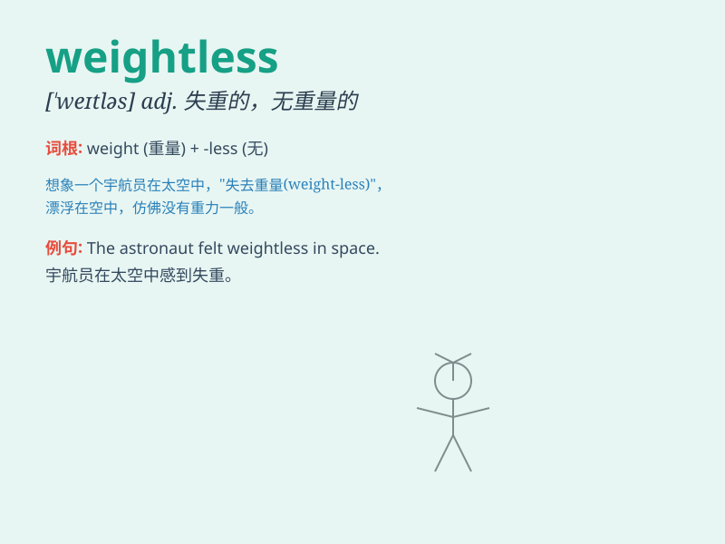

## weightless

**英音:** _[\'weɪtlɪs]_ **美音:** _[\'wetləs]_

**译义:** *adj.无重量的,无重力的*

### 短语

+ **weightless environment:** _失重环境_

+ **weightless state:** _失重状态_

+ **feel weightless:** _感觉失重_

+ **weightless sensation:** _失重的感觉_

+ **weightless experience:** _失重的体验_

### 例句

#### 例句1

> **The astronaut experienced a weightless environment in space.**

**中文翻译:** 宇航员在太空中体验到了失重的环境。

**单词释义:** 失重的

#### 例句2

> **The feather seemed weightless as it floated gently through the
air.**

**中文翻译:** 羽毛在空中轻轻飘浮，似乎没有重量。

**单词释义:** 没有重量的

#### 例句3

> **She felt weightless when she was dreaming of flying freely.**

**中文翻译:** 当她梦到自由飞翔时，她感觉自己轻飘飘的。

**单词释义:** 轻飘飘的

### 背诵小故事

> Astronaut Tom felt weightless when he was in space. He floated
freely, as if gravity had no hold on him. It was an amazing experience
of being weightless and defying the normal pull of Earth.

**宇航员汤姆在太空时感到失重。他自由地漂浮着，仿佛重力对他毫无作用。这是一次令人惊叹的失重体验，摆脱了地球的正常引力。**

### 图义

