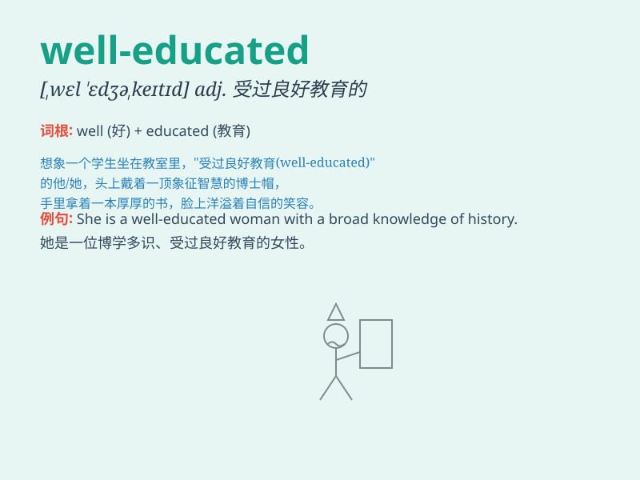

## well-educated

**英音:** _[ˌwel ˈedʒukeɪtɪd]_ **美音:** _[ˌwel
ˈedʒukeɪtɪd]_

**译义:** *adj. 受过良好教育的；有教养的*

### 短语

+ **well-educated person:** _受过良好教育的人_

+ **become well-educated:** _变得受过良好教育_

+ **a well-educated society:** _一个受过良好教育的社会_

+ **remain well-educated:** _保持受过良好教育_

+ **be highly well-educated:** _受到高度良好的教育_

### 例句

#### 例句1

> **She is a well-educated woman who holds a master\'s degree.**

**中文翻译:** 她是一位受过良好教育的女士，拥有硕士学位。

**单词释义:** 受过良好教育的

#### 例句2

> **The company prefers to hire well-educated employees.**

**中文翻译:** 这家公司更愿意雇佣受过良好教育的员工。

**单词释义:** 受过良好教育的

#### 例句3

> **In this modern society, well-educated people tend to have more
opportunities.**

**中文翻译:** 在这个现代社会，受过良好教育的人往往有更多机会。

**单词释义:** 受过良好教育的

### 背诵小故事

> Once upon a time, there was a girl named Lily. She was well-educated.
She read many books, learned various skills, and finally achieved great
success. Her knowledge and wisdom made her stand out.

**从前，有个叫莉莉的女孩。她受过良好的教育。她读了很多书，学习了各种技能，最终取得了巨大的成功。她的知识和智慧让她脱颖而出。**

### 图义

