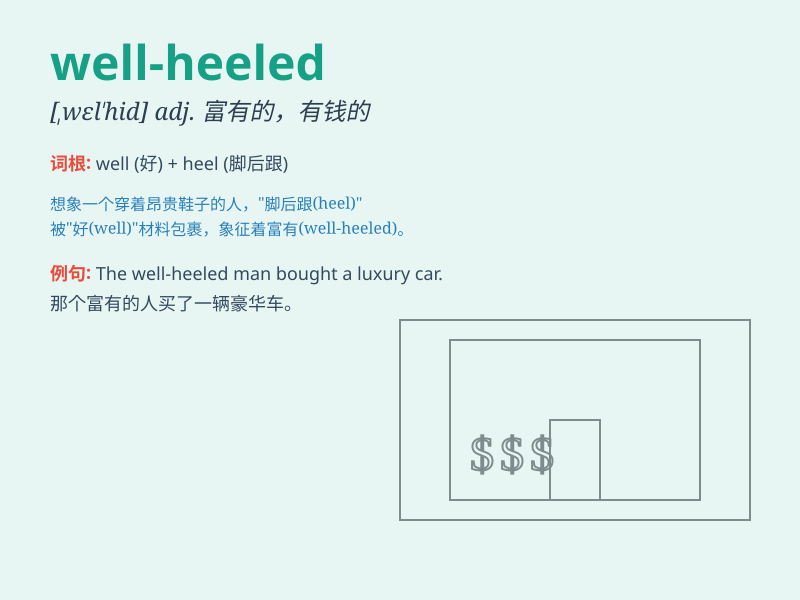

## well-heeled

**英音:** _[ˌwel ˈhiːld]_ **美音:** _[ˌwel ˈhiːld]_

**译义:** *adj. 富有的；穿着考究的*

### 短语

+ **well-heeled family:** _富裕的家庭_

+ **well-heeled client:** _有钱的客户_

+ **well-heeled neighborhood:** _富人区_

+ **become well-heeled:** _变得富有_

+ **a well-heeled lady:** _一位富有的女士_

### 例句

#### 例句1

> **The well-heeled couple often travels to exotic destinations.**

**中文翻译:** 这对富裕的夫妇经常去异国他乡旅行。

**单词释义:** 富裕的

#### 例句2

> **She comes from a well-heeled family and has never known
hardship.**

**中文翻译:** 她来自一个富裕的家庭，从未经历过艰难困苦。

**单词释义:** 富裕的

#### 例句3

> **The well-heeled businessman donated a large sum of money to
charity.**

**中文翻译:** 这位富有的商人向慈善机构捐赠了一大笔钱。

**单词释义:** 富有的

### 背诵小故事

> Imagine a rich person walking gracefully with shiny shoes. The shoes
are so fine because this person is well-heeled, meaning wealthy and
having a lot of money. Just like those perfect shoes, they have a
comfortable and luxurious life.

**想象一个富人优雅地走着，穿着闪亮的鞋子。鞋子如此精美，因为这个人很富有，well-heeled
意思就是富有、有钱。就像那双完美的鞋子一样，他们有着舒适奢华的生活。**

### 图义

