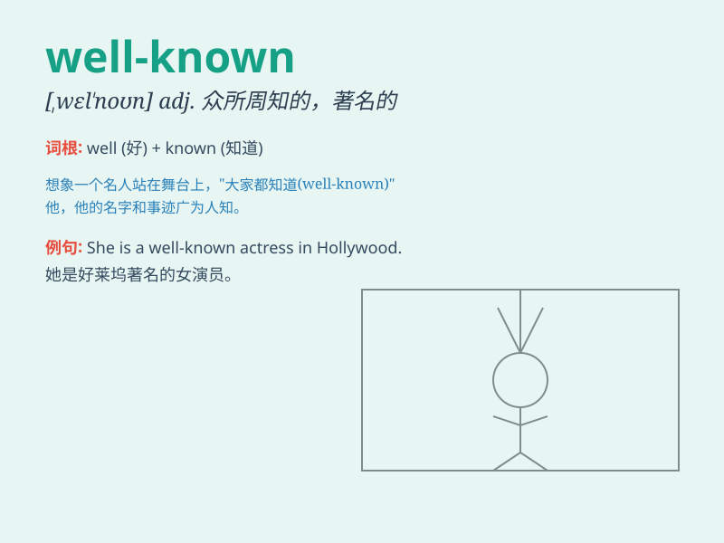

## well-known

**英音:** _[welˈnəun]_ **美音:** _[welˈnoʊn]_

**译义:** *众所周知的，著名的，出名的*

### 例句

#### 例句1

> **The Great Wall is a well-known tourist attraction in China.**

**中文翻译:** 长城是中国著名的旅游景点。

**单词释义:** 著名的

#### 例句2

> **He is well-known for his excellent cooking skills.**

**中文翻译:** 他因出色的烹饪技能而闻名。

**单词释义:** 闻名的

#### 例句3

> **This well-known singer will hold a concert next month.**

**中文翻译:** 这位著名的歌手下个月将举办一场音乐会。

**单词释义:** 著名的

### 背诵小故事

> A young artist painted a beautiful picture. Everyone loved it and
soon he became well-known. People from far and wide came to see his
works. His name was known by all.

**一位年轻的艺术家画了一幅美丽的画。大家都很喜欢，很快他就出名了。来自四面八方的人都来看他的作品。他的名字被所有人知晓。**

### 图义

