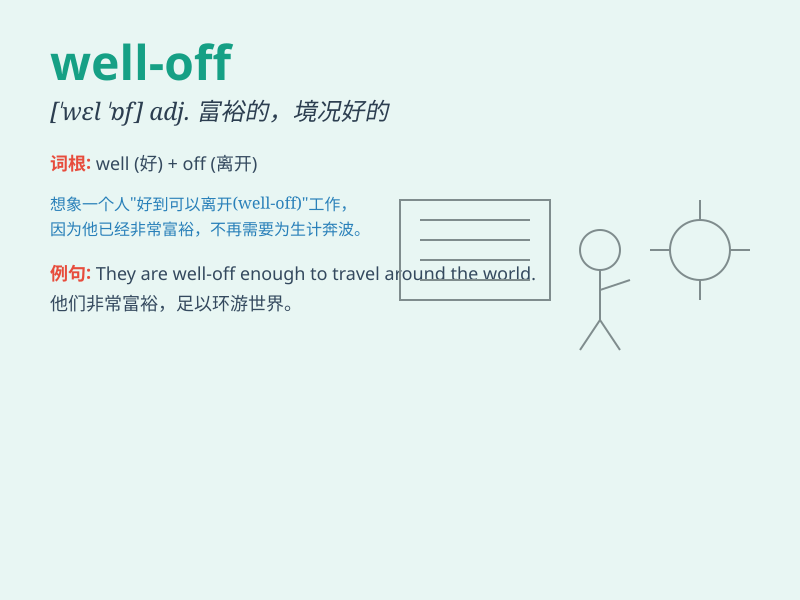

## well-off

**英音:** _[ˌwɛlˈɒf]_ **美音:** _[ˌwɛlˈɔf]_

**译义:** *adj. 富裕的，生活优裕的；顺利的，幸运的*

### 短语

+ **be well-off:** _富裕；处境好_

+ **fairly well-off:** _相当富裕_

+ **become well-off:** _变得富裕_

+ **well-off family:** _富裕家庭_

+ **well-off society:** _小康社会_

### 例句

#### 例句1

> **My family is quite well-off and we can afford many luxuries.**

**中文翻译:** 我的家庭相当富裕，我们能负担得起很多奢侈品。

**单词释义:** 富裕的；小康的

#### 例句2

> **The well-off couple donated a large sum of money to charity.**

**中文翻译:** 这对富裕的夫妇向慈善机构捐赠了一大笔钱。

**单词释义:** 富裕的；经济状况良好的

#### 例句3

> **In some countries, only a small percentage of the population is
well-off.**

**中文翻译:** 在一些国家，只有一小部分人口是富裕的。

**单词释义:** 富裕的；富有的

### 背诵小故事

> Once upon a time, there was a family. They had a big house, nice
cars, and enough money for everything. They were well-off. They could
enjoy life without worrying about money.

**从前，有一个家庭。他们有大房子、好车，有足够的钱满足一切需求。他们很富裕。他们能够享受生活，无需为钱担忧。**

### 图义

