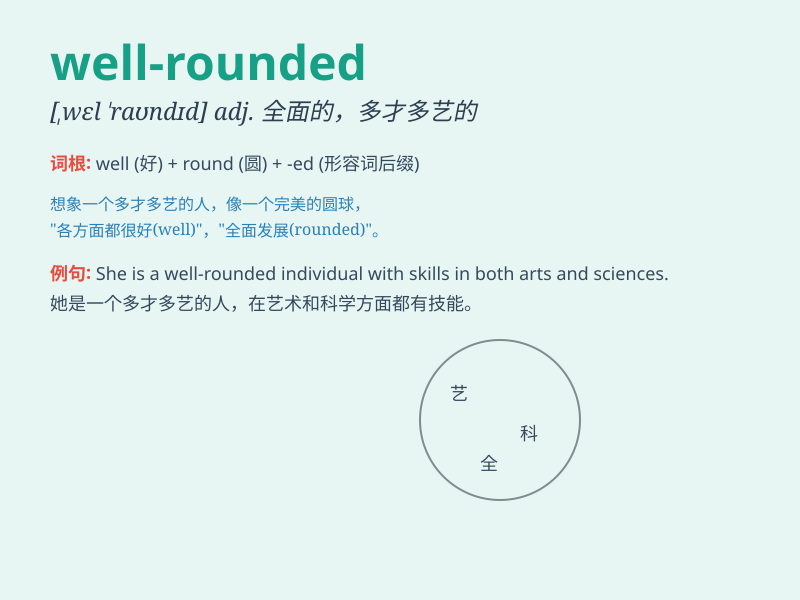

## well-rounded

**英音:** _[ˌwɛl ˈraʊndɪd]_ **美音:** _[ˌwɛl ˈraʊndɪd]_

**译义:** *adj.全面的；多才多艺的；均衡发展的*

### 短语

+ **well-rounded education:** _全面的教育_

+ **well-rounded individual:** _全面发展的个人_

+ **well-rounded skills:** _全面的技能_

+ **well-rounded personality:** _健全的个性_

+ **well-rounded development:** _全面发展_

### 例句

#### 例句1

> **She is a well-rounded student with excellent grades in all
subjects.**

**中文翻译:**
她是一个全面发展的学生，在所有科目中都取得了优异的成绩。

**单词释义:** 全面发展的

#### 例句2

> **The well-rounded education at this school prepares students for
various challenges.**

**中文翻译:** 这所学校全面的教育为学生应对各种挑战做好了准备。

**单词释义:** 全面的

#### 例句3

> **His personality is well-rounded, making him popular among his
friends.**

**中文翻译:** 他的性格很全面，这使他在朋友中很受欢迎。

**单词释义:** 全面的；完善的

### 背诵小故事

> There was a student named Lily. She was not only good at studies but
also excelled in sports and art. Everyone said she was well-rounded. She
could handle various tasks and challenges easily.

**有个叫莉莉的学生。她不仅学习好，在体育和艺术方面也很出色。大家都说她是全能的。她能轻松应对各种任务和挑战。**

### 图义

