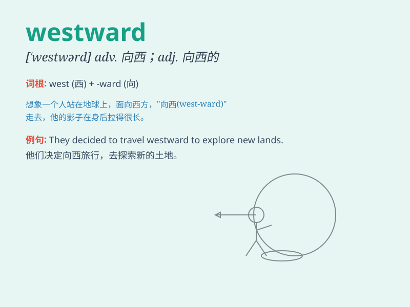

## westward

**英音:** _[\'westwəd]_ **美音:** _[\'wɛstwɚdz]_

**译义:** *n.西方,西部,向西旅行adj.西方的,向西的adv.向西*

### 短语

+ **westward journey:** _西行之旅_

+ **westward expansion:** _向西扩张_

+ **westward movement:** _西进运动_

+ **westward direction:** _向西的方向_

+ **westward wind:** _西风_

### 例句

#### 例句1

> **The pioneers moved westward in search of new land.**

**中文翻译:** 拓荒者们向西迁移以寻找新的土地。

**单词释义:** 向西

#### 例句2

> **The wind was blowing westward.**

**中文翻译:** 风正往西吹。

**单词释义:** 向西的

#### 例句3

> **They set off on a westward journey.**

**中文翻译:** 他们踏上了向西的旅程。

**单词释义:** 向西的

### 背诵小故事

> A brave explorer set off westward. He faced many challenges but was
determined to reach the unknown land in the west. His journey showed the
meaning of westward - moving towards the west.

**一位勇敢的探险家向西出发。他面临许多挑战，但决心到达西边的未知之地。他的旅程展现了westward（向西）的含义------朝着西边移动。**

### 图义

