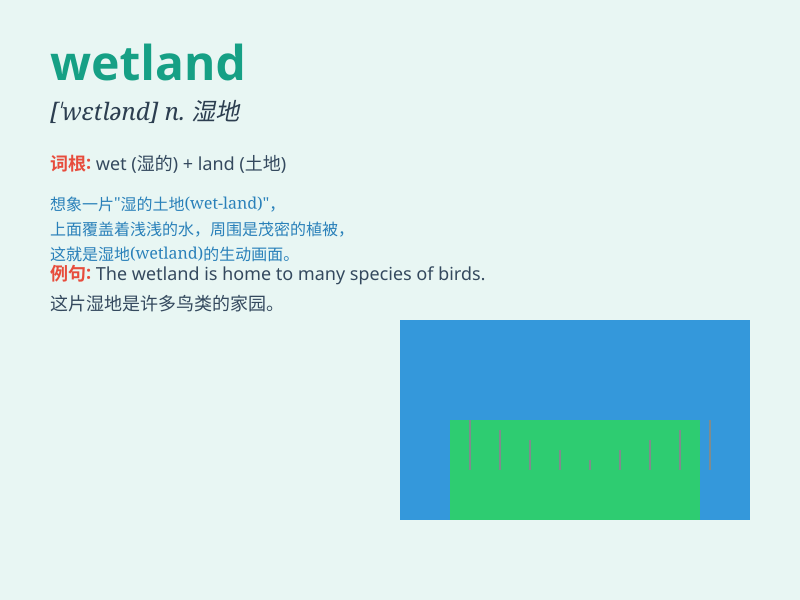

## wetland

**英音:** _[\'wetlənd]_ **美音:** _[\'wɛtlənd]_

**译义:** *n.潮湿的土壤,沼泽地*

### 短语

+ **wetland conservation:** _湿地保护_

+ **wetland habitat:** _湿地栖息地_

+ **wetland restoration:** _湿地恢复_

+ **wetland ecosystem:** _湿地生态系统_

+ **wetland birds:** _湿地鸟类_

### 例句

#### 例句1

> **The wetland is home to many rare birds.**

**中文翻译:** 这片湿地是许多珍稀鸟类的家园。

**单词释义:** 湿地

#### 例句2

> **We went for a walk in the wetland to enjoy the natural
scenery.**

**中文翻译:** 我们去湿地散步，欣赏自然风光。

**单词释义:** 湿地

#### 例句3

> **The government is taking measures to protect the wetland
ecosystem.**

**中文翻译:** 政府正在采取措施保护湿地生态系统。

**单词释义:** 湿地

### 背诵小故事

> One day, Tom got lost in a strange place. It was a wetland full of
water and grass. He struggled to find his way out. Finally, he saw a
sign that led him to safety. Remember, \'wetland\' is a place like this!

**有一天，汤姆在一个陌生的地方迷路了。那是一片湿地，到处是水和草。他努力寻找出路。最后，他看到一个指示牌，带他到了安全的地方。记住，\'wetland\'就是这样的地方！**

### 图义

