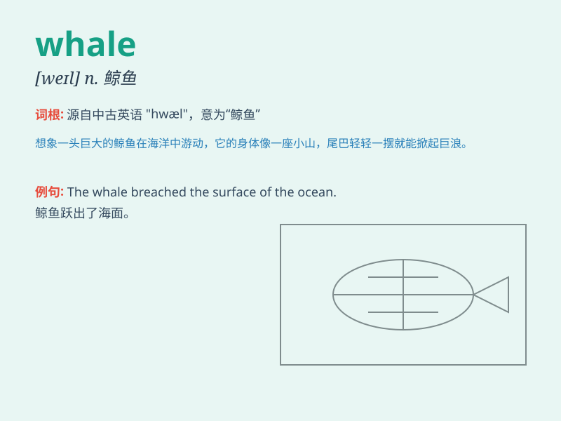

## whale

**英音:** _[weɪl]_ **美音:** _[wel]_

**译义:** *n.鲸v.捕鲸*

### 短语

+ **killer whale:** _虎鲸；逆戟鲸_

+ **blue whale:** _蓝鲸_

+ **sperm whale:** _抹香鲸_

+ **whale oil:** _鲸油_

+ **humpback whale:** _座头鲸_

### 例句

#### 例句1

> **The whale emerged from the deep ocean.**

**中文翻译:** 那头鲸鱼从深海浮现出来。

**单词释义:** 鲸鱼

#### 例句2

> **We went whale watching last weekend.**

**中文翻译:** 上周末我们去观鲸了。

**单词释义:** 鲸鱼

#### 例句3

> **The blue whale is the largest animal on Earth.**

**中文翻译:** 蓝鲸是地球上最大的动物。

**单词释义:** 鲸鱼

### 背诵小故事

> A little boy went to the sea and saw a huge whale. The whale jumped
out of the water and showed its big tail. The boy was so amazed and
never forgot that moment. So when he learned the word \'whale\', he
remembered this wonderful scene.

**一个小男孩去海边看到了一只巨大的鲸鱼。鲸鱼跃出水面并展示了它的大尾巴。小男孩非常惊讶并且永远忘不了那一刻。所以当他学习\'whale\'这个单词时，就想起了这个美妙的场景。**

### 图义

