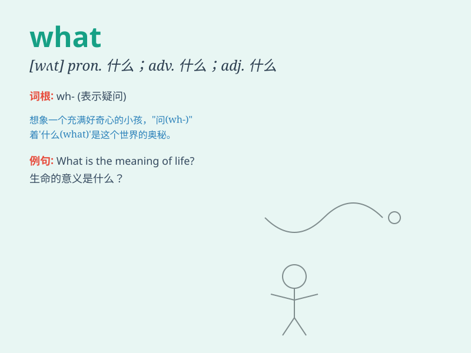

## what

**英音:** _[wɒt]_ **美音:** _[hwɒt; hwɑt]_

**译义:** *
pron.什么int.怎么,多么adj.什么adv.到什么程度,在哪一方面n.本质,实质,要素*

### 短语

+ **what about:** _（用于询问有关某事的意见或情况）怎么样_

+ **what if:** _要是...会怎么样_

+ **what\'s more:** _更有甚者；更为重要的是_

+ **for what:** _为什么；为何目的_

+ **so what:** _那又怎样_

### 例句

#### 例句1

> **What is your name?**

**中文翻译:** 你的名字是什么？

**单词释义:** 什么

#### 例句2

> **What time is it?**

**中文翻译:** 现在几点了？

**单词释义:** 什么

#### 例句3

> **What happened to you?**

**中文翻译:** 你怎么了？

**单词释义:** 什么

### 背诵小故事

> One day, a little boy was lost in a big forest. He kept asking \'What
is this place? What should I do?\' He was very scared and confused.
Finally, he found his way out by remembering the path he came in.

**有一天，一个小男孩在大森林里迷路了。他不停地问'这是什么地方？我该怎么办？'他非常害怕和困惑。最后，他通过记住进来的路走了出去。**

### 图义

