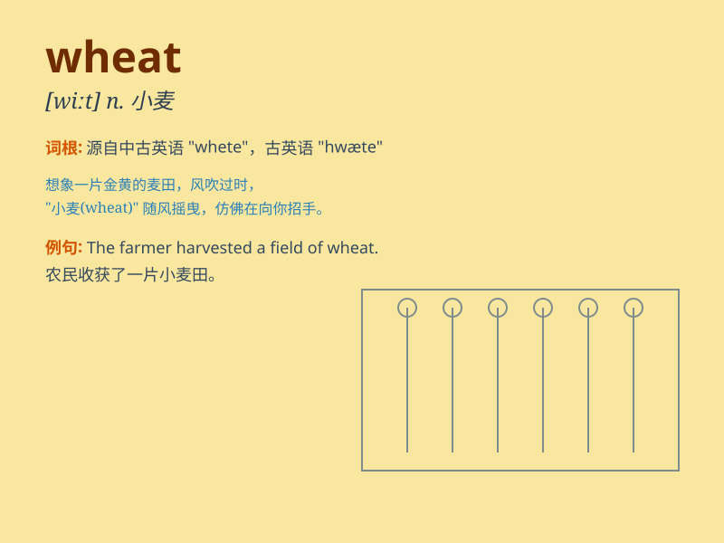

## wheat

**英音:** _[wiːt]_ **美音:** _[wit]_

**译义:** *n.小麦,小麦色,淡黄色,朴实的人*

### 短语

+ **wheat field:** _麦田_

+ **wheat flour:** _小麦粉_

+ **wheat germ:** _小麦胚芽_

+ **winter wheat:** _冬小麦_

+ **spring wheat:** _春小麦_

### 例句

#### 例句1

> **The farmer harvested a lot of wheat this year.**

**中文翻译:** 这位农民今年收获了很多小麦。

**单词释义:** 小麦

#### 例句2

> **We need to buy some wheat to make bread.**

**中文翻译:** 我们需要买一些小麦来做面包。

**单词释义:** 小麦

#### 例句3

> **The price of wheat has gone up recently.**

**中文翻译:** 最近小麦的价格上涨了。

**单词释义:** 小麦

### 背诵小故事

> A farmer was very happy because his field was full of wheat. The
golden wheat danced in the wind. He worked hard and finally could sell
the wheat for a good price.

**一位农民非常高兴，因为他的田地里长满了小麦。金黄色的小麦在风中摇曳。他辛勤劳作，最终能以好价钱卖掉这些小麦。**

### 图义

