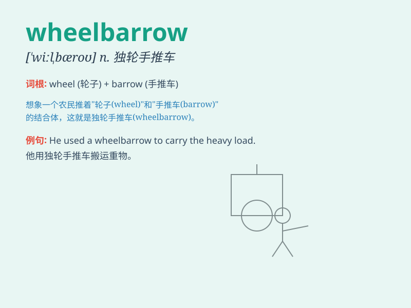

## wheelbarrow

**英音:** _[\'wiːlbærəʊ]_ **美音:** _[\'wilbæro]_

**译义:** *n.独轮手推车,手推车vt.用于推车运送*

### 短语

+ **push a wheelbarrow:** _推一辆手推车_

+ **load the wheelbarrow:** _给手推车装货_

+ **empty the wheelbarrow:** _清空手推车_

+ **repair a wheelbarrow:** _修理手推车_

+ **park the wheelbarrow:** _停放手推车_

### 例句

#### 例句1

> **He pushed the wheelbarrow full of bricks along the path.**

**中文翻译:** 他沿着小路推着装满砖头的独轮车。

**单词释义:** 独轮车

#### 例句2

> **The gardener used a wheelbarrow to transport the soil.**

**中文翻译:** 园丁用一辆独轮车运输土壤。

**单词释义:** 独轮车

#### 例句3

> **She struggled to lift the heavy load into the wheelbarrow.**

**中文翻译:** 她费力地把重物抬进独轮车。

**单词释义:** 独轮车

### 背诵小故事

> One day, a farmer was using a wheelbarrow to carry heavy fruits. The
wheel of the wheelbarrow turned smoothly, making the work much easier.
It was like a helpful friend to the farmer.

**有一天，一位农民正用独轮手推车搬运沉重的水果。独轮手推车的轮子转动得很顺滑，让工作轻松了许多。它就像农民的一位得力朋友。**

### 图义

