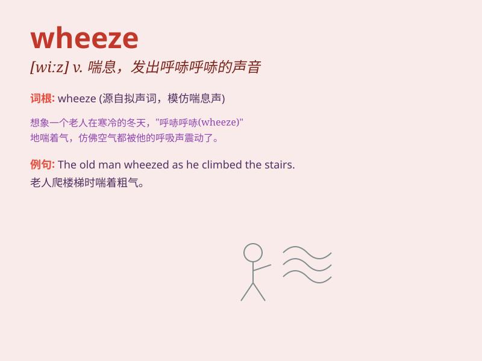

## wheeze

**英音:** _[wiːz]_ **美音:** _[wiz]_

**译义:** *vi.喘息,很困难地呼吸*

### 短语

+ **wheeze out:** _气喘吁吁地说出_

+ **chronic wheeze:** _慢性喘息_

+ **wheeze through:** _艰难地通过_

+ **asthmatic wheeze:** _哮喘性喘息_

+ **wheeze along:** _喘着气前进_

### 例句

#### 例句1

> **He has a chronic wheeze that bothers him especially at night.**

**中文翻译:** 他有慢性的喘息，尤其在晚上困扰着他。

**单词释义:** 喘息；哮鸣音

#### 例句2

> **The old machine wheezed and groaned as it struggled to start.**

**中文翻译:** 这台旧机器在努力启动时发出喘息和呻吟声。

**单词释义:** 喘息声；哼哼声

#### 例句3

> **She let out a wheeze of laughter at the joke.**

**中文翻译:** 听到那个笑话，她发出一阵喘息般的笑声。

**单词释义:** 喘着气的声音

### 背诵小故事

> 想象一下，一个小胖子跑得上气不接下气，不停地发出'wheeze
wheeze'的声音，就像风箱在艰难地喘气。他太胖了，稍微一动就喘得厉害，这就是'wheeze'（喘息；喘息声）的生动体现。

**想象一个小胖子因跑动而喘息，以此来辅助记忆'wheeze'（喘息；喘息声）这个单词**

### 图义

