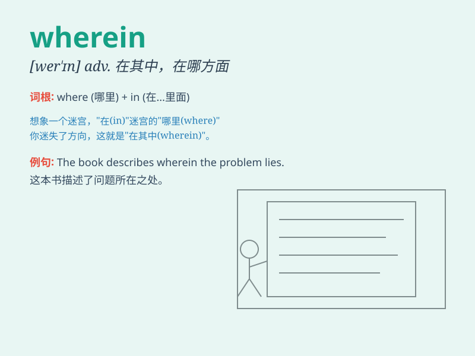

## wherein

**英音:** _[weər\'ɪn]_ **美音:** _[wɛr\'ɪn]_

**译义:** *adv.在何处,在其中*

### 短语

+ **wherein lies:** _其中的所在；在于_

+ **wherein consisted:** _在于由什么组成_

+ **wherein differ:** _在哪些方面不同_

+ **wherein applicable:** _在适用的情况下_

+ **wherein appropriate:** _在适当的地方_

### 例句

#### 例句1

> **The report wherein the details of the project are outlined is
very comprehensive.**

**中文翻译:** 这份其中概述了项目细节的报告非常全面。

**单词释义:** 在其中；在何处

#### 例句2

> **He showed me the book wherein he found the information.**

**中文翻译:** 他给我看了他在其中找到信息的那本书。

**单词释义:** 在那本书中

#### 例句3

> **The problem lies wherein we have underestimated the
difficulty.**

**中文翻译:** 问题在于我们低估了困难所在。

**单词释义:** 在于何处

### 背诵小故事

> A little girl was lost in a big forest. She kept asking herself,
\'Wherein can I find the way out?\' Finally, with the help of a kind
bird, she found the exit. Wherein means in what place or in which.

**一个小女孩在大森林里迷路了。她不停地问自己：'我能从哪里找到出路？'最后，在一只善良的小鸟的帮助下，她找到了出口。wherein
意思是在什么里面；在哪一方面**

### 图义

