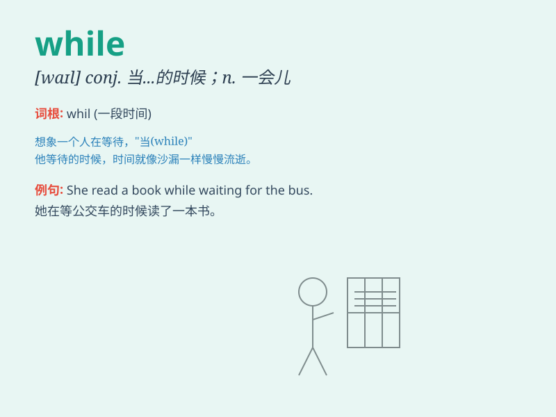

## while

**英音:** _[waɪl]_ **美音:** _[hwaɪl]_

**译义:** *n.一会儿,时间 conj.当\...的时候,虽然vt.消磨
prep.\<古>\<方>直到*

### 短语

+ **while away:** _消磨（时间）_

+ **all while:** _一直；始终_

+ **for a while:** _一会儿；一段时间_

+ **quite a while:** _相当长的一段时间_

+ **a little while:** _一小会儿_

### 例句

#### 例句1

> **While I was reading, she was cooking.**

**中文翻译:** 当我在读书时，她在做饭。

**单词释义:** 当\...\...的时候

#### 例句2

> **You should save some money while you can.**

**中文翻译:** 你应该趁能攒钱的时候攒些钱。

**单词释义:** 趁\...\...

#### 例句3

> **While there is life, there is hope.**

**中文翻译:** 只要活着，就有希望。

**单词释义:** 只要

### 背诵小故事

> One day, a little boy was waiting for his friend. While he was
waiting, he read a book to pass the time. It was a long while before his
friend finally came.

**有一天，一个小男孩正在等他的朋友。当他在等待的时候，他读了一本书来打发时间。过了好长一段时间他的朋友才终于到来。**

### 图义

