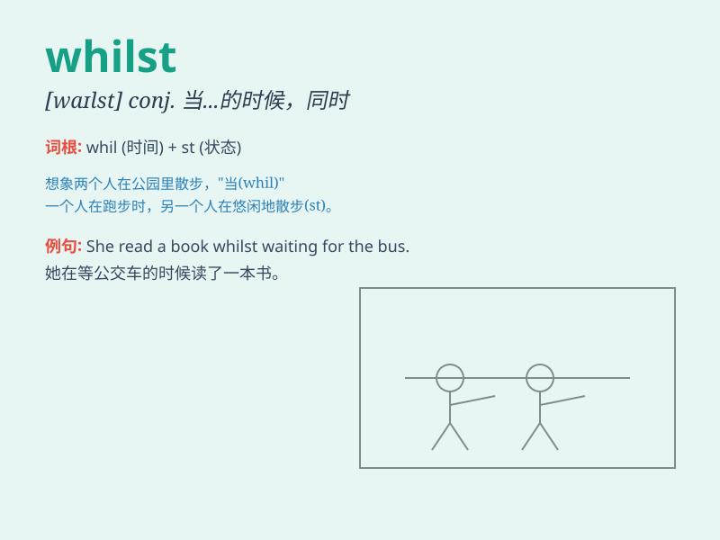

## whilst

**英音:** _[waɪlst]_ **美音:** _[waɪlst]_

**译义:** * conj.时时,同时*

### 短语

+ **whilst still:** _当仍然_

+ **whilst waiting:** _在等待的时候_

+ **whilst asleep:** _在睡着的时候_

+ **whilst working:** _在工作的时候_

+ **whilst reading:** _在阅读的时候_

### 例句

#### 例句1

> **Whilst I understand your point, I still have my reservations.**

**中文翻译:** 虽然我理解你的观点，但我仍然有所保留。

**单词释义:** 虽然；尽管

#### 例句2

> **She was reading whilst waiting for the bus.**

**中文翻译:** 她在等公交车的时候在看书。

**单词释义:** 当\...\...的时候

#### 例句3

> **Whilst in Paris, he visited many famous museums.**

**中文翻译:** 在巴黎期间，他参观了许多著名的博物馆。

**单词释义:** 在\...\...期间

### 背诵小故事

> Once upon a time, there was a little boy who was lost whilst playing
in the forest. He was very scared but finally found his way home.
\'Whilst\' here means \'while\' or \'during the time that\'.

**从前，有一个小男孩在森林里玩耍时迷路了。他非常害怕，但最终找到了回家的路。这里的'whilst'意思是'当\...\...的时候'或'在\...\...期间'。**

### 图义

