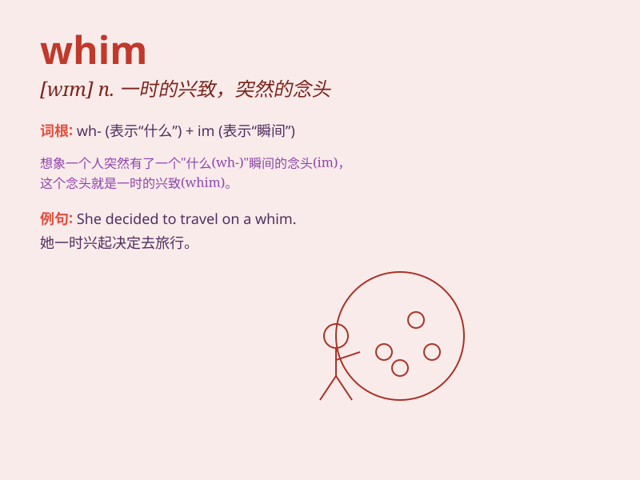

## whim

**英音:** _[wɪm]_ **美音:** _[wɪm]_

**译义:** *n.一时的兴致,幻想,反复无常,怪念头,奇想*

### 短语

+ **on a whim:** _一时冲动；心血来潮_

+ **caprice or whim:** _反复无常或突发奇想_

+ **indulge a whim:** _纵容一时的兴致_

+ **follow a whim:** _随心所欲；跟着兴致行事_

+ **whim of fate:** _命运的无常_

### 例句

#### 例句1

> **On a whim, she decided to take a trip to Paris.**

**中文翻译:** 一时兴起，她决定去巴黎旅行。

**单词释义:** 突然的念头；一时的兴致

#### 例句2

> **He buys things on whim and often regrets it later.**

**中文翻译:** 他凭一时冲动买东西，过后常常后悔。

**单词释义:** 冲动；心血来潮

#### 例句3

> **She changed her hairstyle on a whim.**

**中文翻译:** 她一时心血来潮换了发型。

**单词释义:** 突然的想法；一时的念头

### 背诵小故事

> One day, Tom decided to go on a trip on a whim. He didn\'t plan
anything but just followed his sudden desire. This unexpected decision
brought him many wonderful experiences.

**有一天，汤姆心血来潮决定去旅行。他没有任何计划，只是跟随自己突然的想法。这个意外的决定给他带来了许多美妙的经历。**

### 图义

