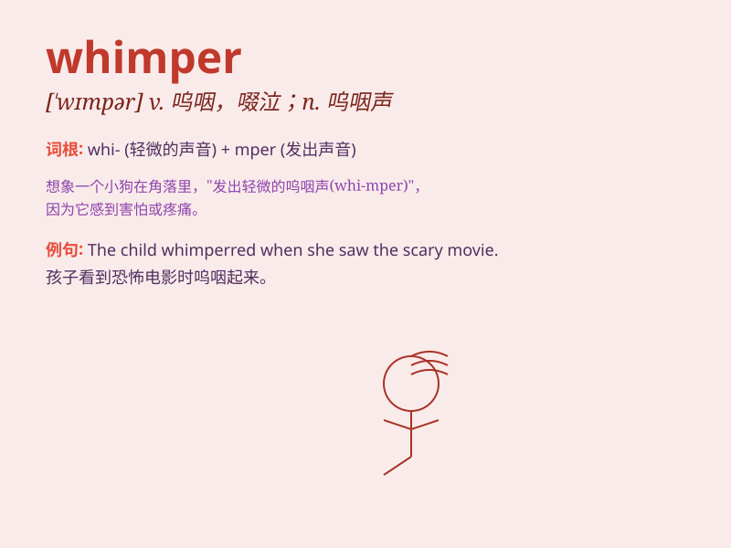

## whimper

**英音:** _[\'wɪmpə]_ **美音:** _[\'wɪmpɚ]_

**译义:** *vi.呜咽,哀诉*

### 短语

+ **whimper in fear:** _因害怕而抽泣_

+ **whimper softly:** _轻轻地呜咽_

+ **let out a whimper:** _发出一声呜咽_

+ **constant whimper:** _持续的抽泣_

+ **whimper with pain:** _因痛苦而呜咽_

### 例句

#### 例句1

> **The puppy whimpered when it was left alone.**

**中文翻译:** 小狗被独自留下时呜呜叫。

**单词释义:** 呜呜叫（表示小狗因孤单而发出的声音）

#### 例句2

> **She whimpered in pain after the accident.**

**中文翻译:** 事故发生后，她痛苦地抽泣着。

**单词释义:** 抽泣（形容人因疼痛而发出的声音）

#### 例句3

> **The child whimpered as he lost his toy.**

**中文翻译:** 孩子丢了玩具，呜呜哭了起来。

**单词释义:** 呜呜哭（表示孩子因失去玩具而发出的声音）

### 背诵小故事

>
一只小狗受伤后，躲在角落里，发出微弱的\'whimper\'声，像是在小声抽泣和呜咽。它的眼神充满了痛苦和无助，那可怜的\'whimper\'让人心疼。

**一只小狗受伤后躲在角落抽泣呜咽的故事**

### 图义

