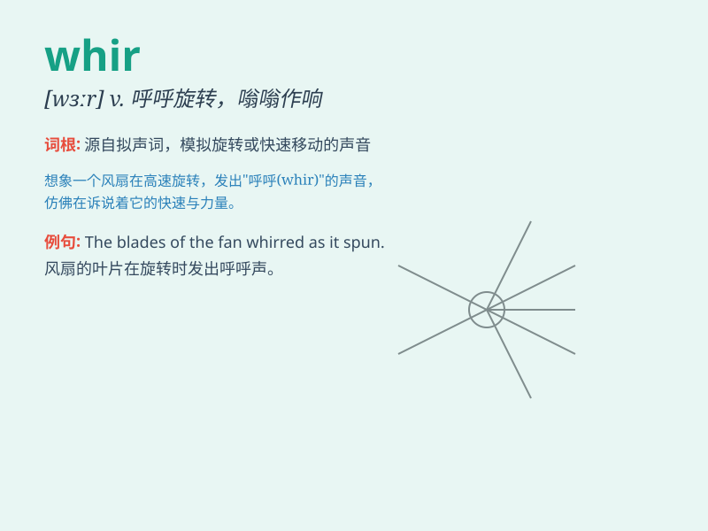

## whir

**英音:** _[wɜː]_ **美音:** _[hwə; wə]_

**译义:** *n.呼呼声vi.急速旋转vt.使呼呼响*

### 短语

+ **whir of wings:** _翅膀的呼呼声_

+ **whir of machinery:** _机器的呼呼声_

+ **constant whir:** _持续的呼呼声_

+ **loud whir:** _响亮的呼呼声_

+ **gentle whir:** _轻柔的呼呼声_

### 例句

#### 例句1

> **The helicopter\'s blades began to whir as it prepared for
takeoff.**

**中文翻译:** 直升机的桨叶开始呼呼旋转，因为它准备起飞了。

**单词释义:** 发出呼呼声（指直升机桨叶旋转的声音）

#### 例句2

> **The computer fans were whirring loudly in the quiet room.**

**中文翻译:** 在安静的房间里，电脑风扇呼呼地响得很大声。

**单词释义:** 呼呼作响（形容风扇转动的声音）

#### 例句3

> **The machine\'s gears whirred as it processed the materials.**

**中文翻译:** 这台机器的齿轮在加工材料时呼呼地转着。

**单词释义:** 呼呼转动（指机器齿轮的转动声）

### 背诵小故事

>
想象一下，你身处一个古老的工厂，里面有很多巨大的风扇。当它们同时快速转动起来，发出的那种连续快速的嗡嗡声，\'whir\'，就像是一种神秘的魔法咒语。

**想象在古老工厂中风扇快速转动发出的连续嗡嗡声来记忆\'whir\'这个单词，表示（机器等）呼呼地飞转，发出嗡嗡声**

### 图义

