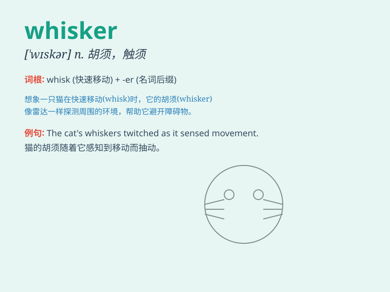

## whisker

**英音:** _[\'wɪskə]_ **美音:** _[\'wɪskɚ]_

**译义:** *n.腮须,胡须,扫拂者vt.使有须,使有须状物*

### 短语

+ **cat\'s whiskers:** _了不起的东西；绝妙的人或物_

+ **by a whisker:** _以毫厘之差_

+ **whisker away:** _迅速带走；匆匆带走_

+ **whisker stress:** _晶须应力_

+ **whisker growth:** _晶须生长_

### 例句

#### 例句1

> **The cat\'s whiskers twitched as it sensed danger.**

**中文翻译:** 当猫感觉到危险时，它的胡须抽动了。

**单词释义:** 胡须（指猫的）

#### 例句2

> **The scientist examined the whisker of the mouse under the
microscope.**

**中文翻译:** 科学家在显微镜下检查了老鼠的胡须。

**单词释义:** 胡须（指老鼠的）

#### 例句3

> **She has a cute mole with a few whiskers on her cheek.**

**中文翻译:** 她的脸颊上有一颗可爱的痣，上面还有几根细毛。

**单词释义:** 细毛

### 背诵小故事

> The cat was very cute. One day, it got lost. We found it by its long
whiskers. The whiskers helped it sense and explore the world. Remember,
whisker is like the cat\'s tool for adventure.

**这只猫非常可爱。有一天，它走丢了。我们通过它长长的胡须找到了它。胡须帮助它感知和探索世界。记住，whisker（胡须）就像是猫冒险的工具。**

### 图义

