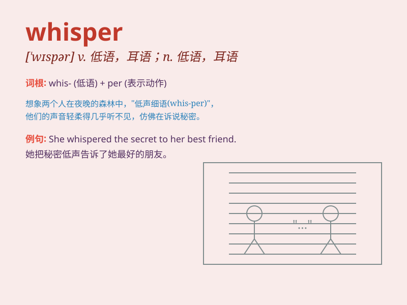

## whisper

**英音:** _[\'wɪspə]_ **美音:** _[\'wɪspɚ]_

**译义:**
*n.耳语,私语,密谈,谣传,飒飒的声音vi.耳语,密谈,飒飒地响vt.低声说*

### 短语

+ **whisper softly:** _轻声低语_

+ **whisper in someone\'s ear:** _在某人耳边低语_

+ **whisper secrets:** _悄悄说秘密_

+ **whisper a prayer:** _轻声祈祷_

+ **whisper words of love:** _低语爱的话语_

### 例句

#### 例句1

> **She leaned over and whispered something in his ear.**

**中文翻译:** 她俯身向他耳语了些什么。

**单词释义:** 低声说；私语

#### 例句2

> **The wind whispered through the trees.**

**中文翻译:** 风在树林中沙沙作响。

**单词释义:** 发出轻柔的声音

#### 例句3

> **The rumor was being whispered from person to person.**

**中文翻译:** 谣言在人们中间悄悄传播。

**单词释义:** 悄悄传播

### 背诵小故事

> One night, in a quiet forest, a little mouse was afraid to speak
loudly. So, it chose to whisper to its friend, \'Let\'s find some food
quietly.\' This shows the meaning of \'whisper\' - to speak very softly
and quietly.

**一天晚上，在安静的森林里，一只小老鼠不敢大声说话。于是，它选择向它的朋友低声说：'咱们悄悄地找点食物。'这体现了'whisper'的意思------非常轻声、小声地说话。**

### 图义

