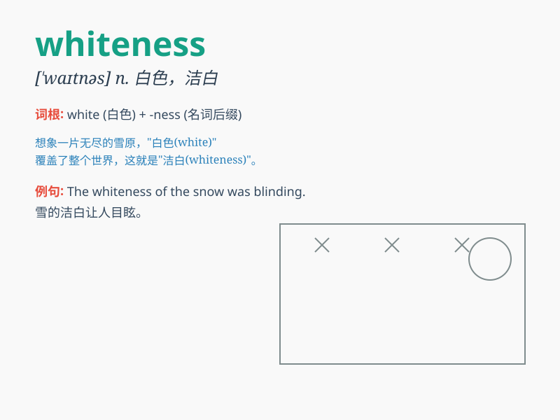

## whiteness

**英音:** _[\'hwaɪtnɪs]_ **美音:** _[\'hwaɪtnɪs]_

**译义:** *n.白,洁白*

### 短语

+ **the whiteness of snow:** _雪的洁白_

+ **whiteness of teeth:** _牙齿的洁白_

+ **achieve whiteness:** _达到洁白_

+ **contrast of whiteness:** _洁白的对比_

+ **preserve whiteness:** _保持洁白_

### 例句

#### 例句1

> **The whiteness of the snow was blinding.**

**中文翻译:** 雪的洁白令人目眩。

**单词释义:** 洁白；白色

#### 例句2

> **She was struck by the whiteness of the walls in the room.**

**中文翻译:** 她被房间里墙壁的洁白所吸引。

**单词释义:** 白色；洁白

#### 例句3

> **The whiteness of his teeth stood out against his dark skin.**

**中文翻译:** 他的牙齿的洁白在他深色皮肤的映衬下很显眼。

**单词释义:** 洁白；雪白

### 背诵小故事

> Once upon a time, in a snowy forest, everything was covered in
whiteness. The pure white snow made the world look so peaceful and
beautiful. It was a scene of perfect whiteness.

**从前，在一个雪林中，一切都被白色所覆盖。纯净的白雪让世界看起来如此宁静和美丽。这是一片完美的洁白景象。**

### 图义

