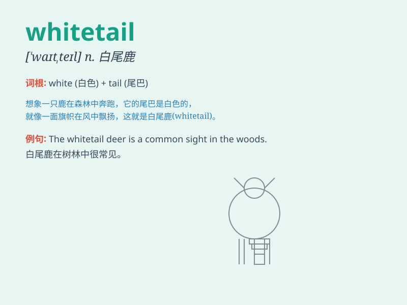

## whitetail

**英音:** _[\'hwaɪtteɪl]_ **美音:** _[\'hwaɪt,tel]_

**译义:** *n.白尾鹿*

### 短语

+ **whitetail deer:** _白尾鹿_

+ **whitetail buck:** _白尾雄鹿_

+ **whitetail doe:** _白尾雌鹿_

+ **whitetail fawn:** _白尾幼鹿_

+ **hunt whitetail:** _狩猎白尾鹿_

### 例句

#### 例句1

> **The whitetail deer gracefully crossed the meadow.**

**中文翻译:** 这只白尾鹿优雅地穿过了草地。

**单词释义:** 白尾鹿

#### 例句2

> **We saw a whitetail in the forest during our hike.**

**中文翻译:** 我们在徒步旅行时在森林里看到了一只白尾鹿。

**单词释义:** 白尾鹿

#### 例句3

> **The hunters were tracking the whitetail for hours.**

**中文翻译:** 猎人们追踪这只白尾鹿好几个小时了。

**单词释义:** 白尾鹿

### 背诵小故事

> In the deep forest, a little deer was running freely. It had a
beautiful white tail, which was like a bright flag. We call this kind of
deer with a white tail \'whitetail\'.

**在幽深的森林里，一只小鹿自由地奔跑着。它有一条漂亮的白色尾巴，就像一面明亮的旗帜。我们把这种有着白色尾巴的鹿叫做'whitetail'。**

### 图义

