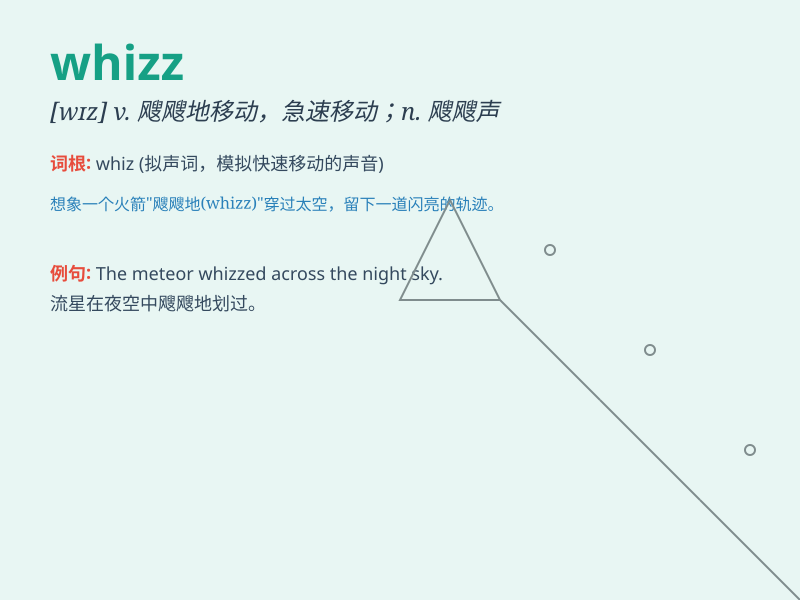

## whizz

**英音:** _[wɪz]_ **美音:** _[wɪz]_

**译义:** *n.子弹等在空中掠过的声音,精明的人,专家v.(使)飕飕作声*

### 短语

+ **whizz kid:** _杰出的年轻人；神童_

+ **whizz through:** _快速完成；迅速通过_

+ **whizz along:** _快速移动；疾驰_

+ **whizz past:** _飞速掠过；一闪而过_

+ **whizz around:** _到处疾驶；快速转动_

### 例句

#### 例句1

> **The car whizzed past us at high speed.**

**中文翻译:** 那辆车高速从我们身边疾驰而过。

**单词释义:** 疾驰；飞速移动

#### 例句2

> **He is a whizz at math.**

**中文翻译:** 他是数学高手。

**单词释义:** 高手；能手

#### 例句3

> **The arrow whizzed through the air.**

**中文翻译:** 箭嗖地穿过天空。

**单词释义:** 嗖地移动

### 背诵小故事

> A little boy was playing with a toy car. When he pushed it hard, the
car made a \'whizz\' sound as it moved fast across the floor. It was
like the car was a speedy hero making a special noise.

**一个小男孩正在玩一辆玩具车。当他用力推它时，车子快速地在地板上移动，发出"嗖"的声音。就好像这辆车是个速度超快的英雄，发出了特别的声音。**

### 图义

