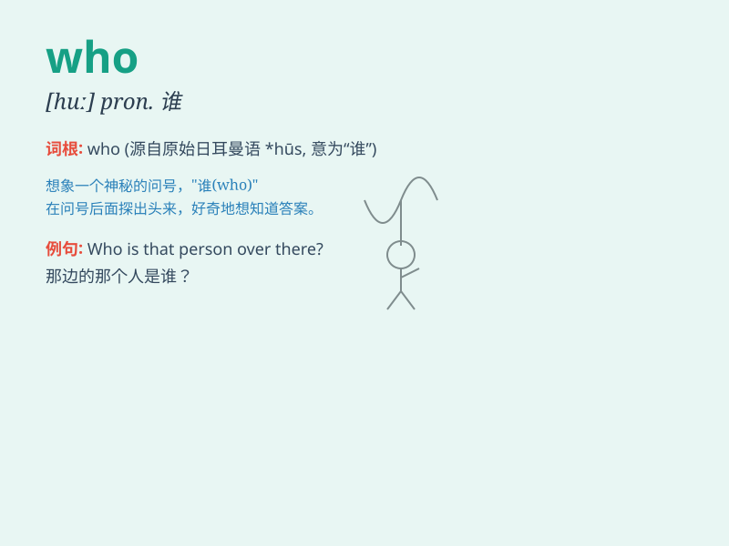

## who

**英音:** _[huː; hʊ]_ **美音:** _[hu]_

**译义:** * pron.谁,那\...的(人) 世界卫生组织 WHO(the World Health
Organization)*

### 短语

+ **who knows:** _谁知道_

+ **for who:** _为了谁_

+ **who else:** _还有谁_

+ **who am I:** _我是谁_

+ **who is who:** _谁是谁_

### 例句

#### 例句1

> **Who is that girl over there?**

**中文翻译:** 那边那个女孩是谁？

**单词释义:** 谁

#### 例句2

> **Who broke the window?**

**中文翻译:** 谁打破了窗户？

**单词释义:** 谁

#### 例句3

> **Who do you think will win the game?**

**中文翻译:** 你认为谁会赢得这场比赛？

**单词释义:** 谁

### 背诵小故事

>
在一个神秘的森林里，小动物们都在好奇是谁（who）弄倒了大树。小松鼠、小兔子和小鸟们纷纷猜测，最后发现是调皮的小熊。大家都记住了这个代表'谁'的单词who。

**在一个神秘的森林里，小动物们都好奇是谁弄倒了大树。小松鼠、小兔子和小鸟们纷纷猜测，最后发现是调皮的小熊。大家都记住了代表'谁'的单词who。**

### 图义

