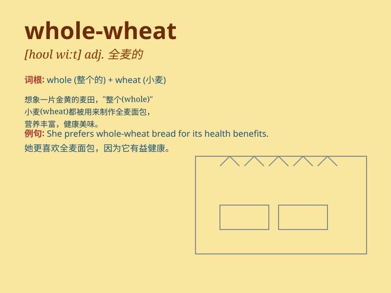

## whole-wheat

**英音:** _[hoʊl wiːt]_ **美音:** _[hoʊl wiːt]_

**译义:** *adj.全麦的；由全麦面粉制成的*

### 短语

+ **whole-wheat bread:** _全麦面包_

+ **whole-wheat flour:** _全麦面粉_

+ **whole-wheat pasta:** _全麦意面_

+ **whole-wheat crackers:** _全麦饼干_

+ **whole-wheat muffin:** _全麦松饼_

### 例句

#### 例句1

> **I prefer whole-wheat bread for its nutritional value.**

**中文翻译:** 我更喜欢全麦面包，因为它有营养价值。

**单词释义:** 全麦的

#### 例句2

> **The store sells whole-wheat pasta.**

**中文翻译:** 这家商店出售全麦意大利面。

**单词释义:** 全麦的

#### 例句3

> **She made a cake using whole-wheat flour.**

**中文翻译:** 她用全麦面粉做了一个蛋糕。

**单词释义:** 全麦的

### 背诵小故事

> Once upon a time, there was a baker who was very proud of his
whole-wheat bread. He told everyone that the whole-wheat made the bread
healthier and more delicious. People loved his bread and always came
back for more.

**从前，有个面包师，他对自己的全麦面包非常自豪。他告诉每个人全麦让面包更健康更美味。人们喜欢他的面包，总是回头购买。**

### 图义

