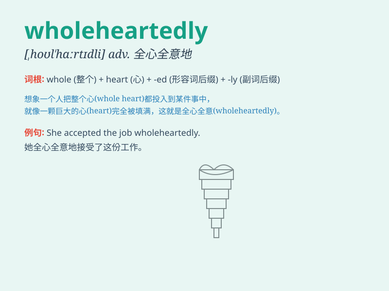

## wholeheartedly

**英音:** _[ˌhoʊlˈhɑːrtɪdli]_ **美音:**
_[ˌhoʊlˈhɑːrtɪdli]_

**译义:** *adv. 全心全意地；全神贯注地*

### 短语

+ **love wholeheartedly:** _全心全意地爱_

+ **support wholeheartedly:** _全心全意地支持_

+ **believe wholeheartedly:** _全心全意地相信_

+ **dedicate wholeheartedly:** _全心全意地奉献_

+ **commit wholeheartedly:** _全心全意地投入_

### 例句

#### 例句1

> **I wholeheartedly support your decision.**

**中文翻译:** 我全心全意地支持你的决定。

**单词释义:** 全心全意地

#### 例句2

> **She loves him wholeheartedly.**

**中文翻译:** 她全心全意地爱他。

**单词释义:** 全心全意地

#### 例句3

> **They worked wholeheartedly to finish the project on time.**

**中文翻译:** 他们全心全意地工作以按时完成项目。

**单词释义:** 全心全意地

### 背诵小故事

> Once upon a time, there was a knight who fought wholeheartedly for
his kingdom. He put his entire heart and soul into the battle, showing
no hesitation or doubt. His wholehearted dedication made him a hero.

**从前，有一位骑士全心全意地为他的王国而战。他全身心地投入战斗，毫无犹豫和疑虑。他全心全意的奉献使他成为了英雄。**

### 图义

