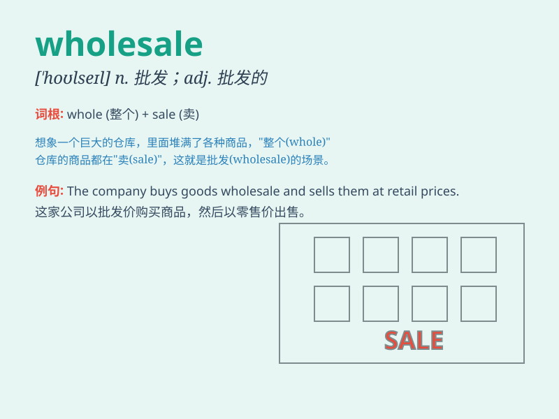

## wholesale

**英音:** _[\'həʊlseɪl]_ **美音:** _[\'holsel]_

**译义:** *n.批发,趸售adj.批发的,[喻] 大规模的*

### 短语

+ **wholesale price:** _批发价格_

+ **wholesale business:** _批发业务_

+ **wholesale market:** _批发市场_

+ **wholesale goods:** _批发商品_

+ **wholesale trade:** _批发贸易_

### 例句

#### 例句1

> **They do wholesale business only.**

**中文翻译:** 他们只做批发生意。

**单词释义:** 批发

#### 例句2

> **The company buys goods at wholesale prices.**

**中文翻译:** 这家公司以批发价购买商品。

**单词释义:** 批发的

#### 例句3

> **Wholesale changes to the system are needed.**

**中文翻译:** 该系统需要大规模的变革。

**单词释义:** 大规模的

### 背诵小故事

> A merchant was in trouble because his retail business wasn\'t doing
well. Then he had a brilliant idea - to switch to wholesale. He bought
goods in large quantities at low prices and sold them to other stores.
Soon, his business thrived!

**一位商人陷入困境，因为他的零售业务不佳。然后他有了一个绝妙的主意------转向批发。他以低价大量购买商品，并将其出售给其他商店。很快，他的生意兴旺起来！**

### 图义

