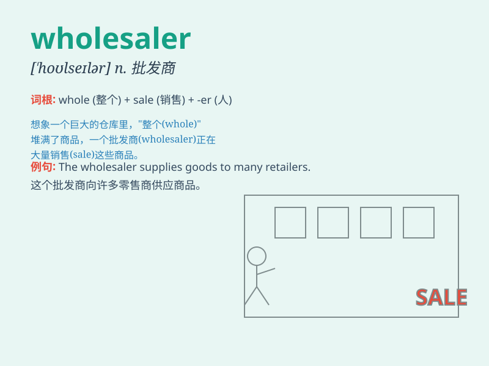

## wholesaler

**英音:** _[ˈhəʊlseɪlə]_ **美音:** _[\'həʊlseɪlə(r)]_

**译义:** *n.批发商*

### 短语

+ **food wholesaler:** _食品批发商_

+ **clothing wholesaler:** _服装批发商_

+ **electronics wholesaler:** _电子产品批发商_

+ **local wholesaler:** _当地批发商_

+ **international wholesaler:** _国际批发商_

### 例句

#### 例句1

> **The wholesaler supplies goods to various retailers.**

**中文翻译:** 这个批发商向各个零售商供应货物。

**单词释义:** 批发商

#### 例句2

> **We got a great deal from the wholesaler for our new store.**

**中文翻译:** 我们为新店铺从批发商那里拿到了一笔很划算的交易。

**单词释义:** 批发商

#### 例句3

> **The wholesaler has a large inventory of products.**

**中文翻译:** 这个批发商有大量的产品库存。

**单词释义:** 批发商

### 背诵小故事

> A wholesaler named Tom was always busy. He bought goods in large
quantities from factories and sold them to retailers. One day, he got a
huge order and made a lot of money. Remember, a wholesaler is like Tom,
dealing in bulk!

**一个叫汤姆的批发商总是很忙。他从工厂大量购买商品然后卖给零售商。有一天，他接到一个大订单，赚了很多钱。记住，批发商就像汤姆，做大量交易！**

### 图义

